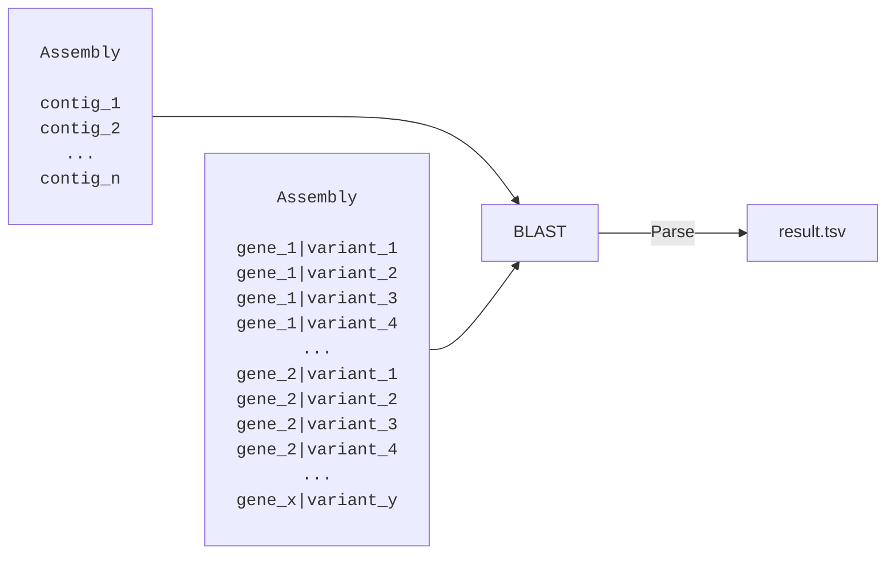

# Location Aware BLAST Parser
**B**asic **L**ocal **A**lignment **S**earch **T**ool (BLAST) is one of the most commonly used local aligners. We won't go into details here about how it works (see the [paper](https://doi.org/10.1016/s0022-2836(05)80360-2)) but assume we have a basic understanding of how it works.

For the remainder of the chapter, we'll assume that we have a genome assembly for which we'd like to identify the locations of probable resistance genes. Also assume that the resistance FASTA file (see table below) consists of serveral genes, for each of which we have many different variants. Within a gene, the variants vary slightly in their nucleotide sequence.

|Gene| Variant| Sequence|
| :-- | :-- | :-- |
|1| 1| ATCGATCG...|
|1| 2| TTCGATCG...|
|1| 3| ATGGATCG...|
|1| 4| ATCGATCT...|
|...|...|...|
|2| 1| GGGATATC...|
|2| 2| CGGATATC...|
|2| 3| GGTATATC...|
|2| 4| GGGATATTG...|
|...|...|...|
|x| y| CGTCGTATT...|

Our goal is to use BLAST and a custom parser to identify *which* of the resistance gene variants exist in the assembly and *where* they are located. BLAST already has the ability to output a .tsv file with custom alignment metrics so why do we need our own parser?

## Why Locations Matter
Hit locations matter primarily because of two reasons.

Very similar sequences match similar (or identical) coordinates in the assembly. For example, if our assembly truly contains `gene_1|variant_2`, then most likely other variants of `gene_1` will also match very well. Not as well, but well. We'd want a way to figure out which one of these matches is the best (based on some criteria) and present this one.

We might have multiple hits for a particular database sequence. If our assembly contains three copies of `gene_1|variant_2`, all in different regions, we want to report all three. Not just one.  

If we plot the raw BLAST results along a particular contig and strand with respect to hit coordinates, it might look something like the image below. Some sequences are co-located or grouped into specific regions `1`, `2` or `3`.

 
	
<pre>
   _______	  	_______			 _______
  _______		_______			_______
  _______ 	    	_______	   	   	_______

------------- ... ----------------- ... ---------------------- ...	contig					
</pre>

<pre>
  ----1----     	---2---			----3----		hit regions
</pre>

We define a *hit region* as a coordinate `(start, end)` within which there are one or more hits that overlap. We don't enforce every hit having to overlap with every other in the region. Instead, we enforce that any adjacent hits `h1`, `h2` must overlap. Using the hit region concept, we can extract the best hit in **each region**. The example table below highlights the best hit in each hit region based on percent identity and percent aligned.

| contig | hit | region | %identity | %aligned |
| :--- | :--- | :--- | :--- | :--- |
| contig_1 | gene_1\|variant_1 | 1 | 99.9% | 100% |
| contig_1 | gene_1\|variant_2 | 1 | 100% | 100% |
| contig_1 | gene_1\|variant_3 | 1 | 99.9% | 100% |
| contig_1 | gene_1\|variant_4 | 1 | 99.9% | 100% |
| ... | ... | ... | ... | ... |
| contig_1 | gene_2\|variant_1 | 2 | 100% | 100% |
| contig_1 | gene_2\|variant_2 | 2 | 99.9% | 100% |
| contig_1 | gene_2\|variant_3 | 2 | 99.9% | 100% |
| contig_1 | gene_2\|variant_4 | 2 | 99.9% | 100% |
|...|...|...|...|...|
| contig_1 | gene_x\|variant_(y-3) | 3 | 99.9% | 100% |
| contig_1 | gene_x\|variant_(y-2) | 3 | 99.9% | 100% |
| contig_1 | gene_x\|variant_(y-1) | 3 | 99.9% | 100% |
| contig_1 | gene_x\|variant_y | 3 | 100% | 100% |

Obviously, we can choose whatever alignment metric(s) we think are relevant for determining the best hit. It is not clear (at least to me) that percent identity and percent aligned are the best parameters to use. Usually, there is a tradeoff between choosing a longer hit with lower identity versus a shorter hit with higher identity. Because of this, it might make sense to choose another parameter such as the e-value or score.

## Assemblies Are Not Perfect
So far we have assumed an ideal assembly without errors. There are three major problems with this assumption:
1. Assemblies are fundamentally derived from reads. Reads can contain sequencing errors.
2. With uneven read depth, entire genome regions migth be missing. 
3. The assembly software is not perfect and can introduce assembly errors.

This means we can't blindly trust the BLAST results. If we can't find a particular gene we don't know if it is because it is truly missing or if that region is missing due to zero coverage.

Worse, we can't even trust a perfect BLAST hit. Imagine we have two variants `v1` and `v2` of the same gene
<pre>
v1	...ATGGGGGGGCA...
v2	...ATGGGGGGCA...
</pre>

where `v2` is one nucleotide shorter (one less `G`). Assume that our sample truly contains `v1`. With an ideal assembly we'd get a perfect match to `v1` and a non-perfect match to `v2`. We'd correctly extract `v1` as the best hit.

<pre>
v1	    	...ATGGGGGGGCA...
v2     		...ATGGGGGG CA...

assembly	...ATGGGGGGGCA...
</pre>

Now, imagine that the non-ideal assembly contains either a sequencing error or assembly error, causing one `G` to be deleted. All of a sudden, `v2` matches perfectly and `v1` does not, even though `v1` is actually in our sample.
<pre>
v1	    	...ATGGGGGGGCA...
v2     		...ATGGGGGGCA...

assembly	...ATGGGGGGCA...
</pre>

This is of real concern when we allow variants of different lengths, such as in MLST analysis.
