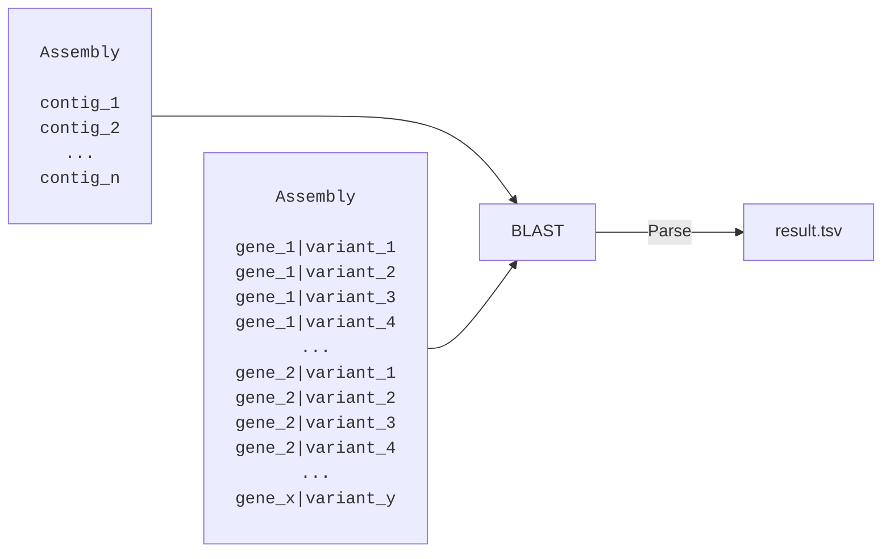

# Location Aware BLAST Parser
**B**asic **L**ocal **A**lignment **S**earch **T**ool (BLAST) is one of the most commonly used local aligners. We won't go into details here about how it works (see the [paper](https://doi.org/10.1016/s0022-2836(05)80360-2)) but assume we have a basic understanding of how it works.

For the remainder of the chapter, we'll assume that we have a genome assembly for which we'd like to identify the locations of probable resistance genes. Also assume that the resistance FASTA file (see table below) consists of serveral genes, for each of which we have many different variants. Within a gene, the variants vary slightly in their nucleotide sequence.

|Gene| Variant| Sequence|
| :-- | :-- | :-- |
|1| 1| ATCGATCG...|
|1| 2| TTCGATCG...|
|1| 3| ATGGATCG...|
|1| 4| ATCGATCT...|
|...|...|...|
|2| 1| GGGATATC...|
|2| 2| CGGATATC...|
|2| 3| GGTATATC...|
|2| 4| GGGATATTG...|
|...|...|...|

Our goal is to use BLAST and a custom parser to identify *which* of the resistance gene variants exist in the assembly and *where* they are located. BLAST already has the ability to output a .tsv file with custom alignment metrics so why do we need our own parser?

## Parsing BLAST Results
Assume we BLAST our assembly against the resistance genes and get a .tsv output file with the following metrics (we'll ignore hit locations for now). Also, for the sake of simplicity we assume all hits are located on contig 1.

|Subject| Query| Query Coverage| Perc Identity|
| :-- | :-- | :-- | :-- |
|contig_1| gene_1\|variant_1| 100% | 99.8% |
|contig_1| gene_1\|variant_2| 100% | 99.8% |
|contig_1| gene_1\|variant_3| 100% | 99.8% |
|contig_1| gene_1\|variant_4| 100% | 99.9% |
|...|...|...|...|
|contig_1| gene_2\|variant_1| 53.2% | 77.3% |
|contig_1| gene_2\|variant_2| 53.2% | 77.2% |
|contig_1| gene_2\|variant_3| 53.2% | 77.2% |
|contig_1| gene_2\|variant_4| 53.2% | 77.2% |
|...|...|...|...|
|contig_1| gene_n\|variant_1| 99.2% | 99.9% |
|contig_1| gene_n\|variant_2| 99.2% | 99.9% |
|contig_1| gene_n\|variant_3| 95.2% | 99.8% |
|contig_1| gene_n\|variant_4| 97.2% | 99.9% |
|...|...|...|...|

First, we'd want to filter out low quality hits. Let's set a threshold of `90%` query coverage and `90%` identity. Filtering the results gives us something like the table below. All variants from gene 1 and gene n were kept, whilst all other variants for all other genes were discarded.

|Subject| Query| Query Coverage| Perc Identity|
| :-- | :-- | :-- | :-- |
|contig_1| gene_1\|variant_1| 100% | 99.8% |
|contig_1| gene_1\|variant_2| 100% | 99.8% |
|contig_1| gene_1\|variant_3| 100% | 99.8% |
|contig_1| gene_1\|variant_4| 100% | 99.9% |
|...|...|...|...|
|contig_1| gene_n\|variant_1| 99.2% | 99.9% |
|contig_1| gene_n\|variant_2| 99.2% | 99.9% |
|contig_1| gene_n\|variant_3| 95.2% | 99.8% |
|contig_1| gene_n\|variant_4| 97.2% | 99.9% |
|...|...|...|...|

In other words, it looks like gene 1 and gene n are present in our assembly, but we don't know which variant yet. Intuitively, we'd just group by `(contig, gene)` and select the best variant, based on some metric such as coverage or identity.

|Subject| Query| Query Coverage| Perc Identity|
| :-- | :-- | :-- | :-- |
|contig_1| gene_1\|variant_4| 100% | 99.9% |
|contig_1| gene_n\|variant_1| 99.2% | 99.9% |

### Considering Multiple Hits
In our simple, hypothetical example this works. In reality however, it is not always the case. Let's look at one example where we get multiple hits for the same gene and variant. In the table below, we have three high quality hits for `gene 1` and `variant 1`. Applying the previous logic, we'd group by `(contig, gene)` and select the best variant, which is the hit with `100%` coverage and `99.8%` identity.

|Subject| Query| Query Coverage| Perc Identity|
| :-- | :-- | :-- | :-- |
|contig_1| gene_1\|variant_1| 100% | 99.8% |
|contig_1| gene_1\|variant_1| 100% | 99.3% |
|contig_1| gene_1\|variant_1| 100% | 99.6% |

> [!NOTE]
> Realistically, if we get multiple hits for variant 1, we probably get multiple hits for the other variants as well. For the educational purposes, we chose to ignore them here.

Can we confidently just remove the other two hits? The answer is no, not without also consider their hit locations. What if they all are located in three completely separate regions in the contig?

|Subject| Query| Query Coverage| Perc Identity| Subject Start| Subject End |
| :-- | :-- | :-- | :-- | :-- | :-- |
|contig_1| gene_1\|variant_1| 100% | 99.8% | 10 | 110 |
|contig_1| gene_1\|variant_1| 100% | 99.3% | 250 | 350 |
|contig_1| gene_1\|variant_1| 100% | 99.6% | 470 | 570 |

We can't remove two out of three hits solely based on the alignment metrics, we need to consider the locations. We do this by grouping our hits by an additional variable - hit region. We define *hit region* as a genome coordinate `(start, end)`, within which there are multiple overlapping BLAST hits. This means, for a given contig (and strand which we ignore for now), overlapping hits belong to the same hit region.

 
<pre>
   _______	  _______
  _______	_______
  _______ 	    _______

|--------------------------------------------------------------------	contig					
</pre>

<pre>
  ----1----     -----2------
</pre>

### Defining Overlaps
Text
