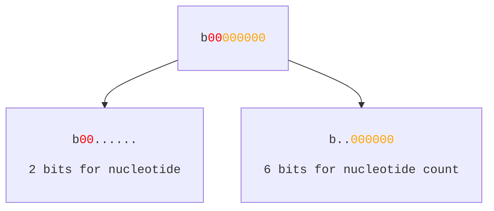
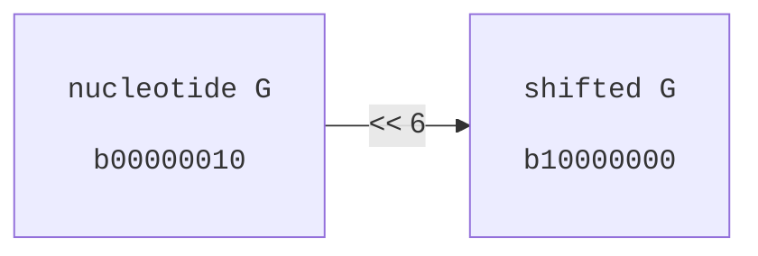

# Bit Shift Storage
We saw in the chapter about [bit shift encoding](../kmers/bit_shift_encoding.md) how to efficiently generate and store kmers. We'll shortly revisit this concept and generalize it to add a bit (pun intended) more flexibility.

## Adding Flexibility
The storage unit we have available is an `unsigned integer`. For example, consider the integer `1_u8`, which looks like `b00000001` when fully printed out. We essentially have `8` slots in which we can store either a `0` or a `1` (boolean value). If our data type is of size 1 bit (e.g., a `bool`), we can store a maximum of 8 `bool`s before we run out of storage. Conversely, if our data type has a size of `8 bits`, we can store a single instance before we run out of space.

Given this, how can we store multiple *different* data types of *different* sizes at once? It is actually relatively straightforward, we just have to reserve different ranges of slots. Consider the example of a tuple of type `(nucleotide, nucleotide_count)` such as `(G, 10)`. How can we store these two types in, say, a `u8`? We saw earlier that we can use `2 bit` encoding for nucleotides, where `A, C, G, T -> b00, b01, b10, b11`. If the nucleotide occupies `2 bits`, we have `6 bits` left to store the nucleotide count, which is equivalent to a maximum allowed value of `2^6 = 64`. This is kinda poor, but will do for now.

Mentally, we can sketch out something like this




In our example case, `G => b00000010` and `10 => b00001010` so our storage for `(G, 10)` would look like `b10001010`. In order to insert our `G`, we need to first shift it enough so as not to overlap the first `6` bits we have reserved for the nucleotide count. We do this with a left shift `<< 6`. We can then insert it with a bitor `|`. For the nucleotide count, we can just insert it **but** we need to make sure that its value is less than `2^6 = 64`. In our case `10` is less than `64` so we are fine.





The following code shows how we could do this for our example `(G, 10)`.
```rust

fn nt_encode(nt: u8) -> u8 {
	match nt{
		b'A' => 0,
		b'C' => 1,
		b'G' => 2,
		b'T' => 3,
		_ => panic!("not allowed")
	}
}

fn main(){
	let nt = nt_encode(b'G');
	let count = 10_u8;
	
	let mut storage = 0_u8;
		
	// insert nt.
	storage |= nt << 6;
	
	// insert count.
	storage |= count;
	assert_eq!(storage, 0b10001010);
}
```

To extract our types from encoded form, we need to use a bit mask. Getting the nucleotide is easy, we'd just right shift by `6`. For our count however, we only want to keep the first `6` bits. Hence, we need a bit mask `b00111111` to ignore the upper two bits reserved for the nucleotide itself.

```rust
fn main(){
	
	let storage = 0b10001010_u8; // (G, 10)
	
	// extract nt.
	let nt = storage >> 6;
	assert_eq!(nt, 0b10);
	
	// extract count.
	let count = storage & (1_u8 << 6) - 1;
	assert_eq!(count, 10);
}
```

## Conclusions
As always, the examples we've used are quite silly. First, maybe it does not make sense to store something like `(G, 10)` in an integer. Even if it did, we certainly don't want only 6 bits for storing the count, since we probably expect counts higher than `2^6 = 64`. The beauty here though is that our approach generalizes to all unsigned integer types, such as `u16`. All of a sudden, we support counts up to `2^14`.

The point is that if our data types have clear size boundaries, we have a method for very efficiently storing these. Two real-world examples where this technique is used in bioinformatics:

**CIGAR operations in BAM files.** The BAM format encodes each CIGAR operation as a `u32` where the lower 4 bits store the operation type (match, insertion, deletion, soft-clip, etc.) and the upper 28 bits store the length.

**k-mer value with strand information.** When building a k-mer index one sometimes need to record not just the k-mer itself but which strand it came from. A 2-bit encoded 31-mer fits in 62 bits, leaving 2 bits free for use to store e.g., strand information.
