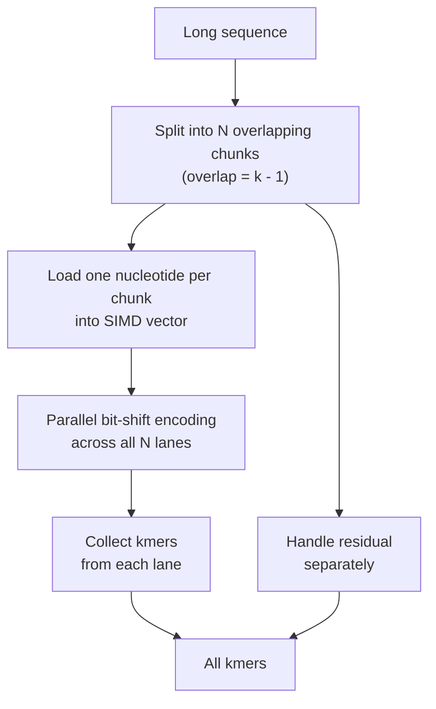

# SIMD Vectorization
Full disclosure - I'm not a computer science expert. Not even close actually. This will not be a heavy theoretical introduction. Rather, I will try to explain how SIMD can be used to significantly speed up bioinformatic analyses. Finally, I think these resources are valuable with respect to SIMD and Rust:
- SIMD on [Wikipedia](https://en.wikipedia.org/wiki/Single_instruction,_multiple_data).
- Rust [std::simd](https://doc.rust-lang.org/std/simd/index.html).
- Rust [core::arch](https://doc.rust-lang.org/core/arch/index.html).
- Rust [x86_64](https://doc.rust-lang.org/core/arch/x86_64/index.html).

## Introduction
SIMD (**S**ingle **I**nstruction **M**ultiple **D**ata) enables certain CPU instructions to be executed in parallel. In contrast to threads, SIMD is more primitive, low level and allows for a more restricted set of operations.

What makes SIMD a bit tricky is that it is architecture specific. Hence, the instruction sets we can use depend on what architecture our computer runs. We'll skip the details here, partially because it is out of scope in this book and partially because I personally don't know enough on this topic.

In the subsequent paragraphs, we assume we are running on the `x86_64` architecture.

### SIMD Registers and Instruction Set Extensions

SIMD operates on fixed-width registers. On `x86_64`, the main SIMD extensions are:

| Extension | Register width | `u64` lanes |
|-----------|---------------|-------------|
| SSE2      | 128-bit       | 2           |
| AVX/AVX2  | 256-bit       | 4           |
| AVX-512   | 512-bit       | 8           |

Even though AVX-512 might be the widest and most powerful, it is not universally supported. SSE2 is effectively ubiquitous on `x86_64`.

## A Pragmatic View
Going back to the previous chapter, we constructed a relatively efficient algorithm for generating kmers from a nucleotide sequence. How can we make this algorithm even more efficient with SIMD?

First, let's look at some pseudo code, inspired by the previous chapter for processing the forward strand.
```rust,noplayground

fn kmerize(kmer_size: usize, nt_string: &[u8]) {
	
    let nbits = kmer_size << 1;
    let mask: u64 = (1 << nbits) - 1;

	// iterate over each nt.
    nt_string.iter().for_each(|nt_char| {
    	// encode
        let nt = LOOKUP[*nt_char as usize] as u64;
        
        // bit shift (add nt)
        storage = (storage << 2 | nt) & mask;
    
    });
}
```

It is obvious that this function handles a single sequence. What if we could process multiple sequences at once? Conceptually (and with pseudo code) it could look something like this

```rust,noplayground
fn kmerize(kmer_size: usize, nt_strings: &[&[u8]]){
	let nbits = kmer_size << 1;
    let mask: u64 = (1 << nbits) - 1;
    
	let storage_simd = create_simd_vector[0_u64; nt_strings.len()];
	
	// assume all nt_string have equal length. 
	let seq_len = nt_strings[0].len();
	
	for i in 0..seq_len {
		let nt_simd = simd_vector::from(nt_strings.iter().map(|s: &[u8]| s[i]));
		
		storage_simd = (storage_simd << 2 | nt_simd) & mask;
	}
}
```

We start with an initial storage SIMD vector the same length as the number of sequences. This way, each sequence gets its own `slot`. In each iteration `i` we extract the `ith` nucleotide from every sequence, create a nucleotide SIMD vector and apply the bit shift in parallel. Schematically, it could look something like this:
```rust,noplayground
nt_strings = [b"ATCA", b"GTGA", b"TCGA"]

storage_simd = [0_u64, 0_u64, 0_u64]

for i in 0..4{
	// for i=0, we extract:
	// * the b'A' from b"ATCA"
	// * the b'G' from b"GTGA"
	// * the b'T' from b"TCGA".
	nt_simd = [0, 2, 3] = [0b00, 0b10, 0b11];
	storage_simd = ([0_u64, 0_u64, 0_u64] << 2 | [0b00, 0b10, 0b11]) & mask = [0b00, 0b10, 0b11]
	
	// for i=1, we extract:
	// * the b'T' from b"ATCA"
	// * the b'T' from b"GTGA"
	// * the b'C' from b"TCGA".
	nt_simd = [3, 3, 1] = [0b11, 0b11, 0b01];
	storage_simd = ([0b00, 0b11, 0b11] << 2 | [0b11, 0b11, 0b01]) & mask = [0b0011, 0b1011, 0b1101]
}
```

Our implementation has a fundamental flaw. What if the sequences don't have the same length? We have to rethink our approach.

## Chunking
Instead of trying to process separate, unrelated sequences at once, what if we can process a single sequence at once?



What if we can cleverly chop our sequence into N equal size chunks (where N is the number of SIMD lanes available) and process them in parallel? We can, with some requirements:
- The sequence has to be reasonably long for this to make sense.
- We have to handle cases where a sequence is not evenly divisible into exactly 8 chunks.

We must first investigate how to chop our sequence. As an example, take the sequence `b"AAATTTCCC"`. With a kmer size of length 3, we want to generate
```
AAA, AAT, ATT, TTT, TTC, TCC, CCC
```

Also, pretend we have 3 SIMD lanes available. We need to chop our sequence into 3 chunks, each of which can be processed in parallel. We must ensure that:
- Each chunk is longer than, or equal to the kmer size.
- We have to handle the residual if the sequence cannot be exactly chunked into 3.

The key is to generate chunks that overlap by `kmer_size - 1` nucleotides. A short motivation for this is that it generates our target kmers. The more nuanced motivation is the following - try chunking into non-overlapping chunks. This would yield `AAA`, `TTT` and `CCC`. Kmerizing these (k=3) would simply give `AAA`, `TTT` and `CCC`, which is fewer kmers than the `sequence_length - kmer_size + 1 = 9 - 3 + 1 = 7` kmers we listed above. One (kinda) correct way to chunk would be
`AAAT`, `ATTT` and `TTCC`, where each sub-sequence is overlapping by `kmer_size - 1 = 3 - 1 = 2`. Kmerizing these would give
```
AAAT -> AAA, AAT
ATTT -> ATT, TTT
TTCC -> TTC, TCC
```
Which is 6 out of the 7 kmers we wanted. We are missing one kmer because the last `C` was excluded from the chunking. But since we know this, we can easily generate the last kmer.

Regardless, with some clever maths (of which the formula I still find hard to derive) we can design our chunks and residual so that all kmers can be easily extracted.

## In Practice
Assume we are running on `AVX-512`, which means we can have (at most) a 512-bit SIMD register. Since we use `u64` as storage for each kmer, we can have at most `512 / 64 = 8` SIMD lanes. If we chop our sequence into 8 equal-length chunks, we can process them in parallel and then handle the residual separately.

In practice though, one would typically use a crate that fully supports all of this out of the box. One example is [simd-minimizers](https://docs.rs/simd-minimizers/latest/simd_minimizers/).
