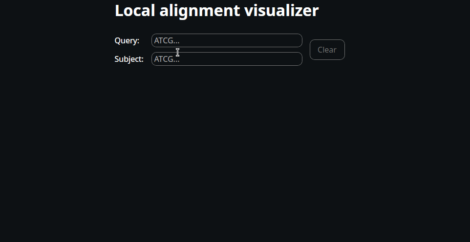

# Creating a desktop app
We have now made our own local aligner, implemented entirely in Rust. It might not be the most efficient, but it works. Now, let us take this a step further and generate a desktop application that can visualize the alignment.

What we need to build it from scratch:
- Our alignment code (which we implemented in the previous section).
- The [Dioxus](https://dioxuslabs.com/) framework.
- A bit of knowledge about HTML and CSS.

We won't go through the entire implementation from scratch. Instead:
- Make sure you are using a Linux operating system.
- Install the Dioxus cli version `v0.7.0-alpha.3`.
- Clone the [repository](https://github.com/OscarAspelin95/alignment_rs).
- Enter the `alignment_rs` directory and run `dx serve`.
- It might take several minutes to compile, but when done the desktop app should launch.

Inspect the code to familiarize yourself with Dioxus. If you have used React before, the syntax might look familiar. Think of Dioxus as React for Rust. In short, the code:
- Checks the input for updates to the query and the subject.
- Calls the aligner when Dioxus detects that the query or subject has changed.
- Renders the alignment in real time.

Note that calling the aligner every time either the query or subject has changed might be extremely inefficient for long sequences. However, in our case we have limited the input length to 80 nucleotides, which is short enough for the UI to be responsive.

Below is a preview of what the desktop app looks like.

</img>
