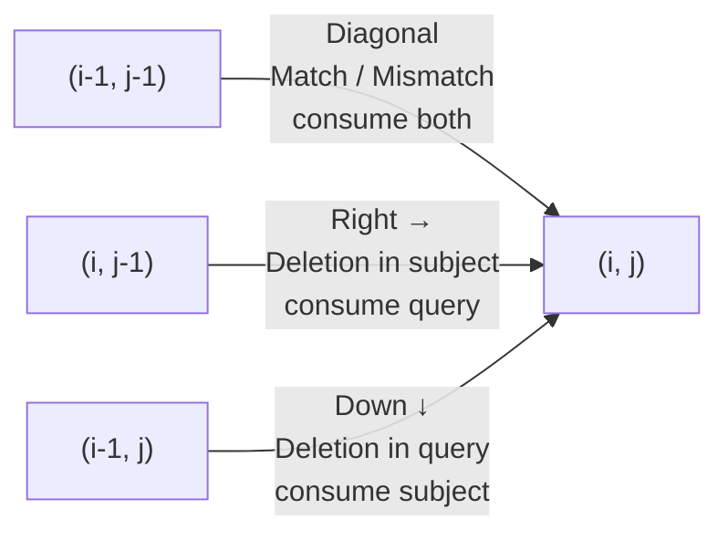

# Edit Distance
## Introduction
In contrast to the Hamming distance, the [Edit distance](https://en.wikipedia.org/wiki/Edit_distance) allows for the query and subject to be different lengths, but it is still a global alignment. There are multiple kinds of Edit distances, of which the [Levenshtein distance](https://en.wikipedia.org/wiki/Levenshtein_distance) is probably the most common. This distance allows for insertions, deletions and substitutions, which is highly suitable for alignment of biological sequences.

The implementation of the Levenshtein distance is more complex than the Hamming distance and requires us to use some dynamic programming. The goal is to use as few insertions, deletions and substitutions as possible to turn one string into the other. We need to be *exhaustive* since we do not know beforehand what is the optimal solution to this problem.

## Setup
To solve this problem, we need a two dimensional array (two dimensions because we have two sequences). The layout will look something like this:

<pre>
    A   T   C   G (query)

A   -   -   -   -

T   -   -   -   -

C   -   -   -   -

G   -   -   -   -

(subject)
</pre>

We want to traverse this array from the start, until we have used up the entire query and subject. We can do this in three different ways:


- A diagonal step means we take a step in both the query and subject (we "consume" both the query and the subject). Depending on the nucleotide we have in the current column (query) and row (subject), this is either a *match* or a *mismatch*.
- A step to the right means we take a step only in the query direction (we "consume" the query). This signifies a *deletion* in the subject sequence (we don't consume it).
- A step downwards means we take a step only in the subject direction (we "consume" the subject). This signifies a *deletion* in the query sequence (we don't consume it).

----
The following path corresponds only to matches between the query and the subject:
<pre>
    A   T   C   G

A   *   -   -   -

T   -   *   -   -

C   -   -   *   -

G   -   -   -   *
</pre>

With the equivalent alignment:
<pre>
query   ATCG
        ||||
subject ATCG
</pre>
----
The following path corresponds to another alignment between the query and the subject:
<pre>
    A   T   C   G

A   *   -   -   -

T   *   -   -   -

C   *   -   -   -

G   *   *   *   *
</pre>

With the equivalent alignment:
<pre>
query   A---TCG
        |
subject ATCG---
</pre>
----

With this in mind, how do we choose the best alignment? We clearly see that the first alignment is a lot better than the second. However, we need to quantify this somehow. The solution is to associate costs:
- Match costs 0.
- Mismatch costs 1.
- Insertion/Deletion costs 1.

The goal is to minimize this cost to generate the best alignment possible.

We can make another observation, which is that for a given position `(i, j)` the value in this position, `array[i][j]`, is dependent on the three adjacent values `array[i-1][j-1]`, `array[i][j-1]` and `array[i-1][j]`. Namely, we want the minimum value from either of these three values, plus the additional cost to get to `(i, j)`, which can be match, mismatch, insertion or deletion:


```
array[i][j] = min(array[i-1][j-1] + cost_of_match_or_mismatch,
                  array[i][j-1] + cost_of_insertion_deletion,
                  array[i-1,j] + cost_of_insertion_deletion)
```


Here, we might realize something. What if there are multiple alignments that generate the same final score? This depends on how we define the costs for matches, mismatches and insertions/deletions AND actually on the order of the arguments in the min function. Min functions usually return the first minimum value if there is a tie. This is something to keep in mind. For now however, we'll just ignore this.


Finally, it also makes sense to initialize a starting position outside of the query and the subject because we could potentially have insertions and deletions at the start. We'll set this value to 0, because there is a match of nothing against nothing. Our final array will look like:

<pre>
            A   T   C   G (query)

        0   -   -   -   -

    A   -   -   -   -   -

    T   -   -   -   -   -

    C   -   -   -   -   -

    G   -   -   -   -   -

(subject)
</pre>

## Implementation
Here is a very naive implementation of the Levenshtein distance. There are many, many ways to optimize this, however it is out of scope in this book.


```rust
#[derive(Clone, Copy)]
enum AlignmentType {
    Match,
    Mismatch,
    DeletionQuery,
    DeletionSubject,
}

fn print_array(array: &Vec<Vec<usize>>) {
    for v in array {
        let values: String = v
            .iter()
            .map(|v| v.to_string())
            .collect::<Vec<_>>()
            .join("\t");
        println!("{values}");
    }
    println!("\n");
}

fn get_alignment_cost(aln: AlignmentType) -> usize {
    match aln {
        AlignmentType::Match => 0,
        AlignmentType::Mismatch => 1,
        AlignmentType::DeletionQuery => 1,
        AlignmentType::DeletionSubject => 1,
    }
}

fn levenshtein_distance(s1: &str, s2: &str) -> usize {
    // We take the number of rows from the subject.
    let m = s2.len();

    // We take the number of columns from the query.
    let n = s1.len();

    // Store array as a vector of vectors.
    let mut array: Vec<Vec<usize>> = Vec::new();

    // Initialize array.
    for _ in 0..m + 1 {
        array.push(vec![0; n + 1]);
    }

    assert!(array[0].len() == s1.len() + 1);
    assert!(array.len() == s2.len() + 1);

    // We move in the i direction (down), subject is consumed and query is deleted.
    for i in 1..m + 1 {
        array[i][0] = i * get_alignment_cost(AlignmentType::DeletionQuery);
    }
    // We move in the j direction (right), query is consumed and subject is deleted.
    for j in 1..n + 1 {
        array[0][j] = j * get_alignment_cost(AlignmentType::DeletionSubject);
    }

    for i in 1..m + 1 {
        for j in 1..n + 1 {
            // For a diagonal move, we need to check if we have a match or mismatch.
            let match_or_mismatch = match s1.chars().nth(j - 1) == s2.chars().nth(i - 1) {
                true => array[i - 1][j - 1] + get_alignment_cost(AlignmentType::Match),
                false => array[i - 1][j - 1] + get_alignment_cost(AlignmentType::Mismatch),
            };

            // We have moved in the j direction so query is consumed and subject is deleted
            let deletion_subject =
                array[i][j - 1] + get_alignment_cost(AlignmentType::DeletionSubject);

            // We have moved in the j direction so subject is consumed and query is deleted
            let deletion_query = array[i - 1][j] + get_alignment_cost(AlignmentType::DeletionQuery);

            // Collect these into a vector.
            let previous_values: Vec<usize> =
                vec![match_or_mismatch, deletion_query, deletion_subject];

            // NOTE - depending on how we define the order of previous_values
            // and our alignment costs, we might get different alignment results.
            let previous_min_value = previous_values.iter().min().unwrap();

            // Update array for current value.
            array[i][j] = *previous_min_value;
        }
    }

    return array[m][n];
}

fn main() {
    assert_eq!(levenshtein_distance("ATCG", "ATCG"), 0);
    assert_eq!(levenshtein_distance("AAAAA", "A"), 4);
    assert_eq!(levenshtein_distance("ATATAT", "GGGGGG"), 6);
    assert_eq!(levenshtein_distance("ATCGATCG", "ATCGTTCG"), 1);
}
```
Yay! We have now implemented another kind of *global aligner* that supports matches, mismatches, insertions and deletions.
