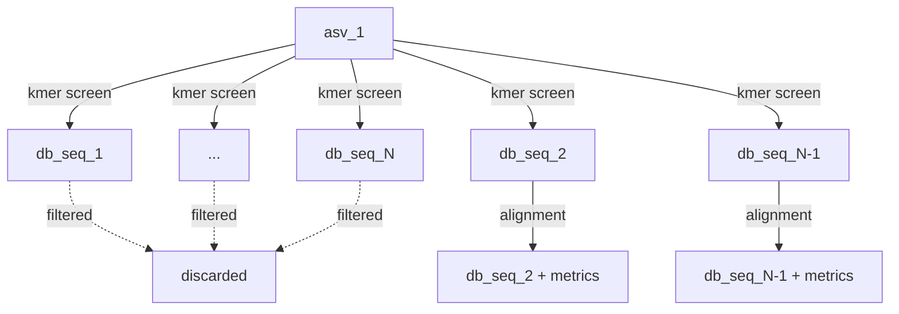

# Classification
The final part of the amplicon chapter is classification. In essence, classification means we have some kind of confidence that a sequence originates from a specific taxon

## Alignment Based Methods
Usually, we'd use a global, semi-global or local aligner. The advantage of alignment based methods is that we can easily extract alignment metrics, such as the number of mismatches and indels, as well as alignment length, percent identity and other metrics. This is relevant if we not only want to find the best database hit, but also know how and where this database hit differs from our sequence.

The downside to alignment based methods is that they are slow when the number of sequences and database entries grow. Another downside, not commonly talked about, is the fundamental issue with choosing only the best database hit. Pretend that our sequence matches to a particular database entry (taxa X) with 99.9% identity, but also matches to another database entry (taxa Y) with 99.85% identity. Can we really be sure that our sequence belongs to taxa X? The difference in identities between the hits could be as little as a single nucleotide. We better make sure our sequence does not contain any errors, since a single sequencing error theoretically could flip the classification from taxa Y to taxa X. If taxa X and taxa Y are different species from the same genus, maybe it makes sense to classify this sequence on genus level. This is especially true for Nanopore data, where sequencing errors can reach several percent.

One algorithm that is worth mentioning here is [EMU](https://github.com/treangenlab/emu), which uses minimap2 to align Nanopore reads to the entire database. Through an iterative maximum likelihood algorithm, based on alignment metrics, it can accurately estimate taxonomic abundances in the sample.

## Alignment Free Methods
These typically use kmers and are based on exact matches. There are numerous ways to use kmers for classification, but one algorithm in particular is worth mentioning. [SINTAX](https://doi.org/10.1101/074161) from the [USEARCH](https://github.com/rcedgar/usearch12) toolkit uses a rather interesting kmer based classification approach that relies on bootstrapped subsampling of kmers to generate a classification confidence score for each sequence. Typically, one first builds a [reverse index](../kmers/building_a_reverse_index.md) of the database. Subsequently, the asvs are classified individually (preferably in parallel):

The following pseudo-code shows an example of how to do this in Rust.

```rust,noplayground
fn main(){
	// config
	let kmer_size: usize = 15;
	let num_bootstraps: usize = 100;
	let num_query_hashes: usize = 32;
	
	let index = build_reverse_index(db_fasta, kmer_size);
	
	for asv in asv_sequences{
		let asv_kmers = kmerize_asv(asv, kmer_size);
			
		// Pick a suitable data structure for storing results
		let asv_result;
		
		for i in (0..num_bootstraps){
			let random_asv_kmers = pick_random_kmers(asv_kmers, num_query_hashes);
			let asv_bootstrap_result = query_reverse_index(random_asv_kmers, index);
			add_to(asv_result, asv_bootstrap_result);
		}
		
		aggregate_results(asv_result);
	}
}
```

The advantage of alignment free methods is that they have the potential to be much faster than alignment based methods. The reason is partly because the use of exact kmer matches over approximate matches.

## Hybrid approaches
It is easy to think that classification has to be either alignment based or alignment free. This is not true. Combining them actually provides some value. For instance, SINTAX outputs a single confidence score of how often an asv matches a particular database sequence. This is metric is a proxy for how well they match but does not give us any alignment metrics such as percent identity. What if we also add an alignment step here? Once we have the identified the best hit(s) for an asv, we run a more exact aligner to quantify the actual alignment between the sequences.




This is a very common approach in bioinformatics. Initially using a fast, approximate matching algorithm to filter out potential candidates followed by a more exact method enables accurate classification whilst reducing computational burden.


## Implementing A Classifier
This section won't actually cover working Rust code that implements a classifier. We, however, have all components in place. The following crates can be used for inspiration:
- [sintax_rs](https://github.com/OscarAspelin95/sintax_rs) - Rust implementation of the SINTAX algorithm.
- [bio_utils_rs](https://github.com/OscarAspelin95/bio_utils_rs) - A collection of bioinformatic utilities.
- [simd_minimizers](https://docs.rs/simd-minimizers/latest/simd_minimizers/) - SIMD accelerated minimizer generation.
