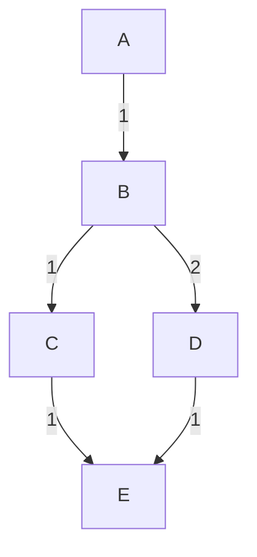
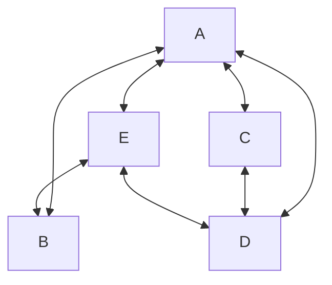
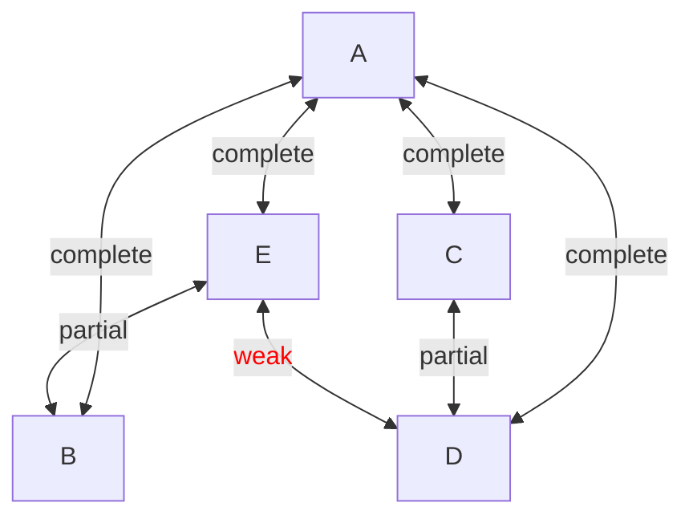

# Petgraph
Our crate of choice here is [petgraph](https://docs.rs/petgraph/latest/petgraph/). It enables us to pretty easily implement a directed graph with edge weights. This crate also outputs the graph in [DOT](https://graphviz.org/doc/info/lang.html) format, which enables us to visualize it with [Graphviz](https://graphviz.org/). For reproducibility purposes, `petgraph = "0.8.3"` was used in the code example below.

> [!NOTE]
> Unfortunately, since petgraph is not part of Rust Playground, this code snippet is not interactive.


```rust,noplayground
use petgraph::dot::Dot;
use petgraph::graph::Graph;

const COST: u32 = 1;

fn main() {
    let mut g = Graph::<String, u32>::new();

    let a = g.add_node("A".into());
    let b = g.add_node("B".into());
    let c = g.add_node("C".into());
    let d = g.add_node("D".into());
    let e = g.add_node("E".into());

    g.extend_with_edges(&[
        (a, b, COST),
        (b, c, COST),
        (b, d, COST + 1),
        (c, e, COST),
        (d, e, COST),
    ]);

    let dot = Dot::new(&g);

    std::fs::write("where/to/write/graph.dot", &dot.to_string().as_bytes())
        .expect("Failed to write dotfile.");
}
```

The code example above will generate a graph that looks something like the image below. We have defined a basic directed graph for nodes `A, B, C, D, E` with some (semi) arbitrary edge weights.



## Adding Bioinformatic Context
The previous code implementation generated a very simple graph with random edge weights. In many cases we'd consider these weights as <q>distances</q> or <q>costs</q>, with the goal of minimizing the total weight between two nodes. For example, if nodes are cities and weights are distances, we could use Dijkstras algorithm to find the shortest path between two nodes.

```rust,noplayground
use petgraph::algo::dijkstra;

// ...

// shortest distance A->E
let dist = dijkstra(&g, 0.into(), Some(4.into()), |g| *g.weight());
```

In the bioinformatic context, nodes are reads and the weights are some quantitative information about the read overlap (e.g., the number of overlapping bases). We'd also get a significantly more complex graph because one read can overlap with many other reads. Based on how reads overlap, we might be able to simplify the graph significantly.

Pretend we have the following overlap graph. Without further context, I'd personally have a hard time identifying potential graph simplification steps (because I don't have that much experience in neither assembly nor graph theory). We see that `A` overlaps with all other nodes (reads) which is interesting.



Let's add some metadata about these overlaps. Maybe the actual overlaps look something like the image below. If we define overlap types between nodes `N1` and `N2` intro three arbitrary categories:
* `complete` - Either node is completely contained in the other.
* `partial` - Nodes have a prefix-suffix or suffix-prefix overlap.
* `weak` - Nodes barely overlap (consider removing).

<pre>
A	-----------------------------------
B	  -------------
C				-------
D			  ------------
E		    --------
</pre>

Then we can update our graph by adding overlap types as labels. 



If our `complete` category also included what node is contained by the other, we'd see that reads `B, C, D, E` all are subsets of read `A`. In this very (very) simple example we can conclude that reads `B, C, D, E` do not contribute to the assembly contiguity. We **cannot** discard them from the sample, but they aren't relevant (in this example) for this particular step in the assembly process.
