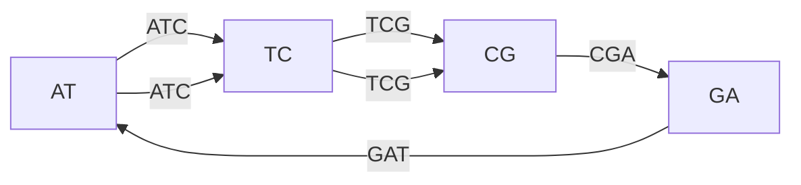
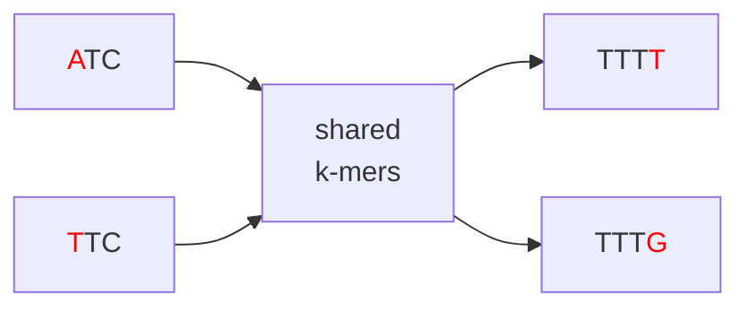

# De Bruijn Graph
As we saw in the previous section, the overlap graph approach requires visiting every read (vertex) exactly once, which is an NP-hard problem. De Bruijn graphs reformulate the problem so that we visit every *edge* exactly once instead. This is an **Eulerian path problem**, which can be solved in linear time.

The key shift: instead of whole reads being vertices, we'll use **kmers as edges**.

## Construction

Given a read and a kmer size `k`, we first extract every kmer. Each kmer becomes an edge, with its (k-1)-mer prefix as the `source` node and its (k-1)-mer suffix as the `destination` node.

For example, take the sequence `ATCGATCG` with `k = 3`. We can create a total of `8 - 3 + 1 = 6` kmers. For each kmer we also divide it into two overlapping prefix/suffix kmers of length `3 - 1 = 2`.

| k-mer | source | destination |
|--|--|--|
| `ATC` | `AT` | `TC` |
| `TCG` | `TC` | `CG` |
| `CGA` | `CG` | `GA` |
| `GAT` | `GA` | `AT` |
| `ATC` | `AT` | `TC` |
| `TCG` | `TC` | `CG` |

Note that `ATC` and `TCG` each appear twice because `ATCG` is repeated in the sequence. We'll now construct a graph with the kmer as edge and the prefix/suffix as vertices. It'll look something like:

## Eulerian Path

To reconstruct the genome we find a path that traverses every edge exactly once (defined as an Eulerian walk). In a directed multigraph, such a path mathematically exists only when:
- For all but two nodes: in-degree equals out-degree
- The **start node**: out-degree = in-degree + 1
- The **end node**: in-degree = out-degree + 1

Checking degrees for our example, counting the parallel edges:

| node | in | out |
|--|--|--|
| `AT` | 1 | 2 |
| `TC` | 2 | 2 |
| `CG` | 2 | 1 |
| `GA` | 1 | 1 |

`AT` has one more out-edge than in-edges (out=2, in=1), so by the rule above it must be the start node. `CG` has one more in-edge than out-edges (in=2, out=1), making it the end node. `TC` and `GA` are balanced and can appear anywhere in between. A valid Eulerian path would be:

\\[ \texttt{AT} \to \texttt{TC} \to \texttt{CG} \to \texttt{GA} \to \texttt{AT} \to \texttt{TC} \to \texttt{CG} \\]

To reconstruct the sequence, take the first node and append the last character of each subsequent node:

\\[ \texttt{AT} + C + G + A + T + C + G = \texttt{ATCGATCG} \\]

Which is exactly our original sequence.

## Repeats

Repeats cause the same fundamental problem they did for the overlap graph. When the same sequence appears multiple times in the genome, its k-mers are identical regardless of which copy they came from. These k-mers collapse into the same edges, merging paths that should stay separate — creating a structure known as a **bubble**.

Recall the inexact repeat from the previous section. Both copies share a long middle region but differ at their first and last characters (highlighted in red). The shared k-mers collapse into a single path through the graph, while the divergent ends branch off on either side:

Just as before, both possible pairings produce valid Eulerian paths. Without prior knowledge of the genome, we cannot determine which entry connects to which exit.

## Choosing kmer size

The choice of kmer size has a large effect on the graph structure:

- **Small k**: short k-mers occur frequently by chance, potentially creating a highly tangled graph.
- **Large k**: long k-mers are more unique, but are more sensitive to sequencing errors.

There is no universally optimal kmer size. In practice, assemblers like SPAdes construct graphs for multiple values of `k` simultaneously and combine the results.

## De Bruijn Graphs In Practice
For a real sample, the graph won't look like the example above:
- It'll be huge due to the number of generated kmers and their respective overlaps.
- Sequencing errors will cause lots of issues such as dead ends in the graph.
- We have not even considered ploidy yet. For haploid genomes such as bacteria, we don't have to worry that much. However, for polyploid organisms this quickly becomes messy.
