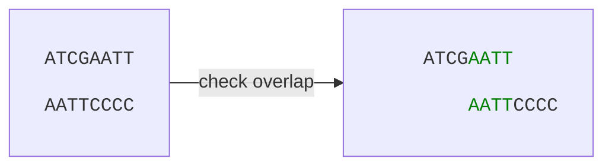
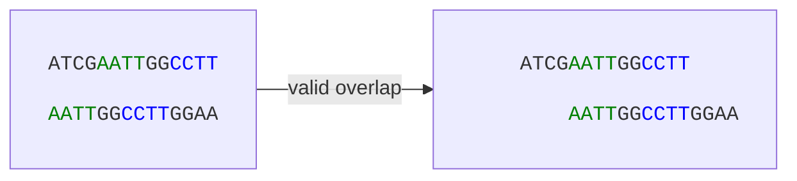
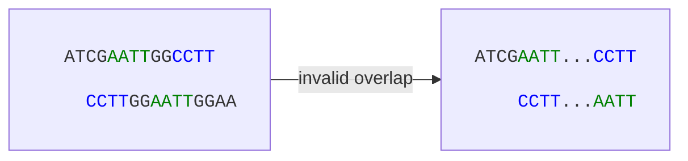

# Finding Read Overlaps
We now have a minimizer index. Next, we need to find reads that overlap. Unfortunately, if we want to check every single reads against each other, this runs in `O(n²)` time. Anyways - we can set up some criteria with relation to read overlaps:
* Two reads must share some minimizers.
* The location of the shared minimizers must make sense.


## The Concept
In the diagram below, we have a mock example of a perfectly valid suffix-prefix overlap for a single shared minimizer.



If we have multiple shared minimizers (see mock example below), we need to take their read locations into consideration when identifying potential read overlaps.

In the valid case, both minimizers appear in the same relative order across both reads:



In the invalid case, the minimizers appear in opposite order in the second read and we would not classify this as a valid overlap.



## In Practice
Given our minimizer index, we can find candidate overlapping reads efficiently. For each read, we look up each of its minimizers in the index and collect all other reads that share at least one minimizer. These are our candidates — but as we saw above, sharing minimizers is not enough on its own.

For each candidate pair we then check whether the shared minimizers are consistent. Concretely, if minimizer **A** appears at position `i` in read 1 and position `j` in read 2, and minimizer **B** appears at position `i'` in read 1 and position `j'` in read 2, then the relative order must be preserved:

```
(i < i') && (j < j')
```

If this holds for all shared minimizers, we have a likely overlap. The difference in positions (`i - j`) also gives us an estimate of where the overlap starts.
