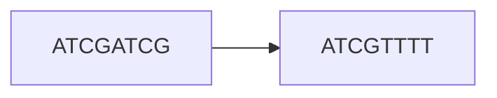

# Graphs
Fundamentally, a graph is a structure that shows relationships between objects. Since graph theory is an entire separate branch of mathematics, we'll merely scratch the surface here.

## Introduction
Since we are dealing with bioinformatics, consider two sequences `S1` and `S2` that share some characteristic. We can visualize this relationship with a graph

We'll call `S1` and `S2` *vertices* and the connection between them an *edge*. Mathematically, we describe the graph as

\\[
	Graph = G(V, E)
\\]

Where *G* signifies a graph and *V* and *E* are vertices and edges respectively.

## Directed Graphs
The graph above is *directed* — the edge explicitly goes from `S1` to `S2`, not the other way around. In assembly, direction matters because we care about which sequence comes first (i.e., whose suffix overlaps whose prefix). All assembly graphs we'll discuss are directed.

## Two Paradigms
There are two main graph-based approaches to genome assembly:

- **Overlap graphs**: each *read* is a vertex, and edges connect reads that share a suffix/prefix overlap. Reconstructing the genome means finding a path that visits every vertex exactly once. This is called a **Hamiltonian walk** and is an NP-hard problem.

- **De Bruijn graphs**: each *k-mer* is an edge, and the (k-1)-mer prefix and suffix of each k-mer are the vertices. Reconstructing the genome means finding a path that visits every edge exactly once. This is called a **Eulerian walk** and can be solved in linear time.

This difference — Hamiltonian (NP-hard) vs. Eulerian (linear time) — is the key reason why de Bruijn graphs became the dominant approach for short-read assembly. The next two sections cover each approach in detail.
