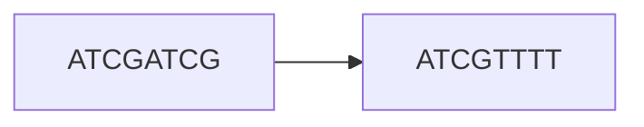
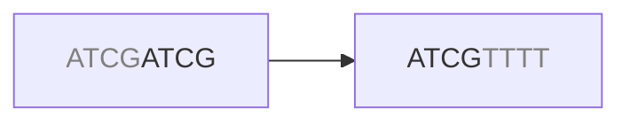
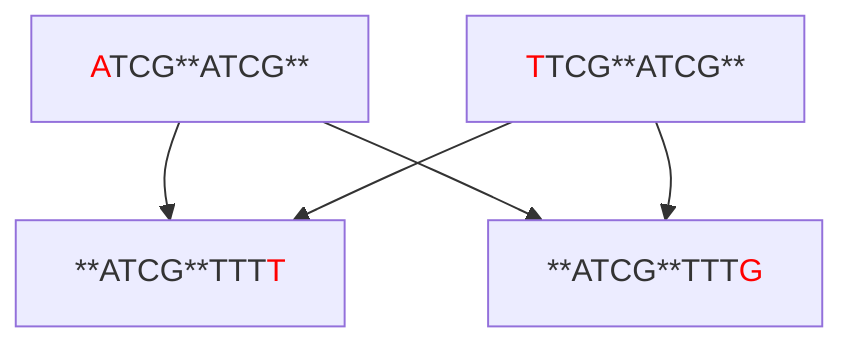

# Graphs
Fundamentally, a graph is a structure that shows relationship between objects. Since graph theory is an entire separate branch of mathematics, we'll merely scratch the surface here.

Since we are dealing with bioinformatics, consider two sequences `S1` and `S2` that share some characteristic. We can visualize this relationship with a graph



We'll call `S1` and `S2` *vertices* and the connection between them an *edge*. The graph above is an example of a *directed acyclic* graph because:
- We have an explicit direction `ATCGATCG -> ATCGTTTT`.
- There are no cycles or loops.

Mathematically, we describe the graph as

\\[ 
	Graph = G(V, E)
\\]

Where *G* signifies a graph and *V* and *E* are vertices and edges respectively.

A natural question now arises, what does the edge mean? What characteristic is shared between the sequences that makes us draw an edge? In theory, I guess we could choose any arbitrary characteristic such as sequence length, GC content or entropy. In our example, `S1` and `S2` share a more important characteristic that is the key to genome assembly - they overlap. Specifically, the suffix of `S1` overlaps with the prefix of `S2`.



Stacking the sequences vertically further illustrates this

```
....ATCG
    ATCG....
```

How come reads overlap to begin with?

One possibility is that the reads originate from the same unique part of the genome. If we sequence deep enough, we <q>cover</q> the genome several times and the possibility for the relevant reads to overlap increases. These are the overlaps we are interested in.

```
		  ATCGATCG		 # S1
			  ATCGTTTT		 # S2
..........ATCGATCGTTTT.......... # True genome
```

Another possibility is that the genome contains an exact repeat. Imagine that the sequence `ATCGATCGTTTT` occurs two or more times somewhere in the genome. All of a sudden, we don't know if `S1` and `S2` have a valid overlap, because we don't know from which region `S1` and `S2` originate (might be from different repeats).

```
..........ATCGATCGTTTT..........ATCGATCGTTTT.......... # True genome
```

In our silly example above, it might not matter that much since both repeats are identical. However, this is practically extremely important for two reasons:
- The genome can contain in-exact repeats.
- The reads contain sequencing errors which means we cannot use exact overlaps.

As an example, assume the true genome looks something like this
<pre>..........<span style="color:red">A</span>TCGATCGTTT<span style="color:red">T</span>..........<span style="color:red">T</span>TCGATCGTTT<span style="color:red">G</span>.......... # True genome</pre>

which contains two very similar but not identical sequences. We'll consider this an in-exact repeat. The different sequences we'd get would look something like

|repeat| S1| S2|
|--|--|--|
|[1] <font color=red>A</font>TCGATCGTTT<font color=red>T</font>|<font color=red>A</font>TCG**ATCG**|**ATCG**TTT<font color=red>T</font>|
|[2] <font color=red>T</font>TCGATCGTTT<font color=red>G</font>|<font color=red>T</font>TCG**ATCG**|**ATCG**TTT<font color=red>G</font>|

Now we start to see the problem - `S1 [1]` and `S1 [2]` both overlap with `S2 [1]` and `S2 [2]`. We'd get a graph that looks something like this:



How do we know what the true genome sequences are?

| pairing | repeat 1 | repeat 2 |
|--|--|--|
| S1[1]→S2[1], S1[2]→S2[2] | <font color=red>A</font>TCGATCGTTT<font color=red>T</font> | <font color=red>T</font>TCGATCGTTT<font color=red>G</font> |
| S1[1]→S2[2], S1[2]→S2[1] | <font color=red>A</font>TCGATCGTTT<font color=red>G</font> | <font color=red>T</font>TCGATCGTTT<font color=red>T</font> |

Again, remember that if we do a de-novo assembly we have **no** prior knowledge about what the genome looks like. We only have the graph to rely on.
