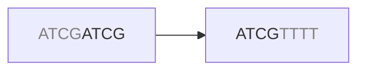
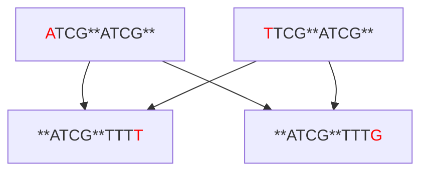
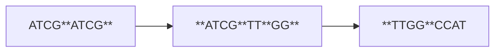

# Overlap Graph

In an overlap graph, each read is a vertex and edges connect reads that share a suffix/prefix overlap. This is the most intuitive graph-based approach to assembly — reads that overlap likely came from adjacent regions of the genome.

## Overlaps
A natural question arises: what does the edge between two reads actually mean? In theory, we could choose any arbitrary characteristic such as sequence length, GC content or entropy. In practice, the characteristic that matters for assembly is that the reads overlap. Specifically, the suffix of one read overlaps with the prefix of the next.



Stacking the sequences vertically further illustrates this

```
....ATCG
    ATCG....
```

How come reads overlap to begin with?

One possibility is that the reads originate from the same unique part of the genome. If we sequence deeply enough, we <q>cover</q> the genome several times and the possibility for the relevant reads to overlap increases. These are the overlaps we are interested in.

```
		  ATCGATCG		 # S1
			  ATCGTTTT		 # S2
..........ATCGATCGTTTT.......... # True genome
```

## Repeats
Another possibility is that the genome contains an exact repeat. Imagine that the sequence `ATCGATCGTTTT` occurs two or more times somewhere in the genome. All of a sudden, we don't know if `S1` and `S2` have a valid overlap, because we don't know from which region `S1` and `S2` originate (might be from different repeats).

```
..........ATCGATCGTTTT..........ATCGATCGTTTT.......... # True genome
```

In our silly example above, it might not matter that much since both repeats are identical. However, this is practically extremely important for two reasons:
- The genome can contain inexact repeats.
- The reads contain sequencing errors which means we cannot use exact overlaps.

As an example, assume the true genome looks something like this
<pre>..........<span style="color:red">A</span>TCGATCGTTT<span style="color:red">T</span>..........<span style="color:red">T</span>TCGATCGTTT<span style="color:red">G</span>.......... # True genome</pre>

which contains two very similar but not identical sequences. We'll consider this an inexact repeat. The different sequences we'd get would look something like

|repeat| S1| S2|
|--|--|--|
|[1] <font color=red>A</font>TCGATCGTTT<font color=red>T</font>|<font color=red>A</font>TCG**ATCG**|**ATCG**TTT<font color=red>T</font>|
|[2] <font color=red>T</font>TCGATCGTTT<font color=red>G</font>|<font color=red>T</font>TCG**ATCG**|**ATCG**TTT<font color=red>G</font>|

Now we start to see the problem - `S1 [1]` and `S1 [2]` both overlap with `S2 [1]` and `S2 [2]`. We'd get a graph that looks something like this:



How do we know what the true genome sequences are?

| pairing | repeat 1 | repeat 2 |
|--|--|--|
| S1[1]→S2[1], S1[2]→S2[2] | <font color=red>A</font>TCGATCGTTT<font color=red>T</font> | <font color=red>T</font>TCGATCGTTT<font color=red>G</font> |
| S1[1]→S2[2], S1[2]→S2[1] | <font color=red>A</font>TCGATCGTTT<font color=red>G</font> | <font color=red>T</font>TCGATCGTTT<font color=red>T</font> |

Again, remember that if we do a de novo assembly we have **no** prior knowledge about what the genome looks like. We only have the graph to rely on.

## Graph Traversal
With all of the previous sections in mind, we can reconstruct the genome by traversing a given graph, taking the overlaps into consideration. Consider three reads with pairwise suffix/prefix overlaps (highlighted in bold):



Traversing from `R1` to `R3`, at each step we advance past the overlap and take the unique suffix of the current read. Stacking the reads shows this clearly:

```
ATCGATCG
    ATCGTTGG
        TTGGCCAT
----------------
ATCGATCGTTGGCCAT
```

The assembled sequence is `ATCGATCGTTGGCCAT`.

What we just did is called a **Hamiltonian walk**: a path through the graph that visits every *vertex* exactly once. This is a natural fit for the overlap graph approach since each read is a vertex and we want to use every read exactly once in our assembly.

The problem is that finding a Hamiltonian walk is an NP-hard problem — there is no known algorithm that can solve it efficiently for large graphs. With millions of reads, this quickly becomes computationally intractable.

This is why the **Eulerian walk** becomes important. Rather than visiting every vertex once, an Eulerian walk visits every *edge* exactly once. This sounds like a subtle difference, but it has a huge practical consequence: finding an Eulerian walk can be solved efficiently in linear time. The De Bruijn graph, covered in the next section, is specifically designed so that genome reconstruction becomes an Eulerian rather than a Hamiltonian problem.
