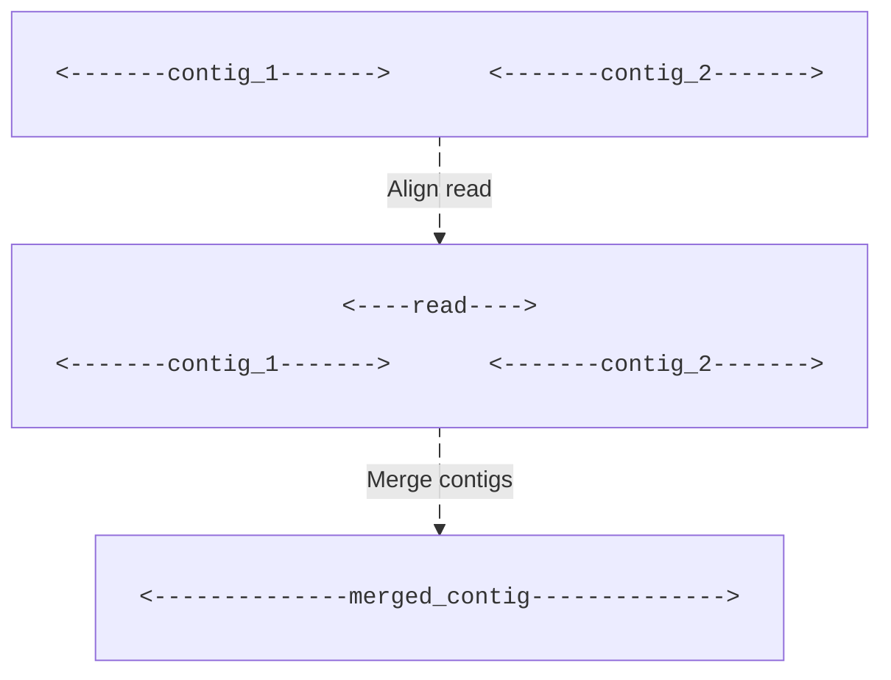
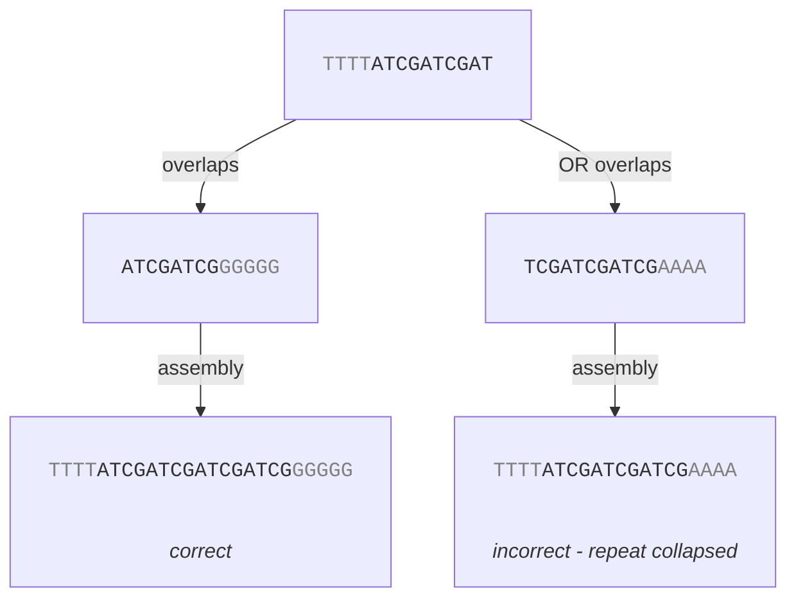
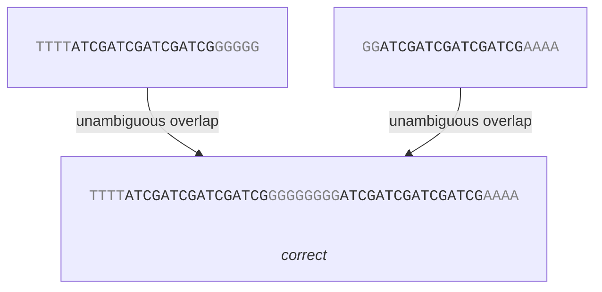
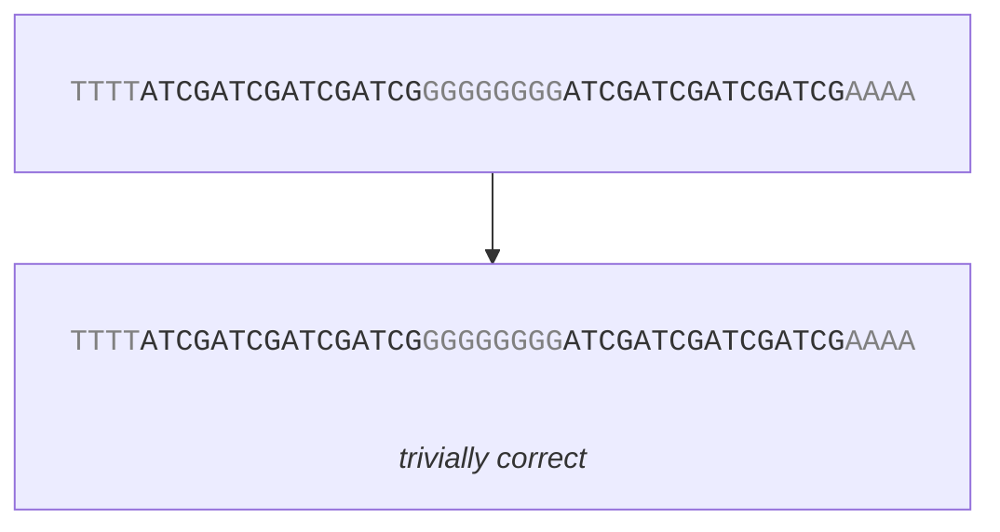

# The Impact of Read Length
Before we continue, let's briefly think about read length for a while. Assume we are building an overlap graph, using the methods described in the previous chapters. How does read length impact the overlap graph?

## The Jigsaw Puzzle Analogy
Let's first use a (relatively) good analogy - a jigsaw puzzle. Image you are trying to complete a large and relatively complex jigsaw puzzle. The motif is intricate and contains repeating elements (maybe a meadow of flowers). The complete genome is the completed puzzle and the reads are individual puzzle pieces. Also assume that a longer read length is analogous with a bigger puzzle piece.

If we have very short reads, our puzzle might consist of 100,000 pieces. It will take forever to complete and if we look at a single piece, we'll have a hard time identifying what flower is depicted on the piece (they all look very, very similar).

On the contrary, if we have very long reads the entire process becomes much easier. Maybe we only have 100 pieces. Each piece now depicts multiple flowers and it is much easier to identify where the piece fits in the puzzle.

A genome assembly is actually quite similar to trying to complete a jigsaw puzzle. The difference is that in a genome assembly, we normally have a mean coverage of more than 1x but also varying coverage (in the puzzle analogy, it would be similar to having duplicated pieces that can be slightly different and have different duplication rates).

You think it is by accident that Oxford Nanopore if generally prefered in the context of genome assembly? I think not. Theoretically, one could sequence the entire (linearized) chromosome in a single read. In practice however, this is not the case. Regardless, longer reads simplify the assembly process quite a bit.

## A More Practical View
Why are longer reads important in genome assembly? 

First - long reads can be used as <q>scaffolds</q>. If we have a few reads of `100,000 bp`, we already have a relatively large portion of the genome sequenced in very few reads. For example, the <em>Escherichia coli</em> genome is roughly `5 Kbp` in size. With 10 reads of length `100,000 bp`, we already have a mean coverage of `0.2x`. Without overlap detection, we don't know **where** in the genome. They might all overlap perfectly over one single `100,000 bp` region, they might slightly overlap over a `~1,000,000 bp` region, something in between, or they might not overlap at all. If we assume the reads only contain substitutions and small scale indels, we have a *very* good base.

```

<----100,000 bp----->
           <----100,000 bp----->
                    <----100,000 bp----->
                      <----100,000 bp----->
                                       <----100,000 bp----->
                                              
<---------------------------------------------------------------...--> entire genome
```

Second - long reads can act as bridges between contig candidtates. A very common approach in genome assembly is to re-align the reads back to the contig candidates to merge as many contigs as possible. The longer the reads are, the easier in general this is.



 Third - long reads are more efficient at solving repeats. For simplicity, assume we have the sequence `ATCGATCGATCGATCG` repeated twice in the genome:
 
<pre>
 <font color=gray>TTTT</font>ATCGATCGATCGATCG<font color=gray>GGGGGGGG</font>ATCGATCGATCGATCG<font color=gray>AAAA</font>
</pre>

 Short reads that align inside the repeats don't add that much information and we can't use them to resolve the repeats. Reads that, however, align across the start or end of the repeats are more interesting.
 
 <pre>
  <font color=gray>TTTT</font>ATCGATCGAT            <font color=gray>GG</font>ATCGATCGAT
              ATCGATCG<font color=gray>GGGGG</font>        TCGATCGATCG<font color=gray>AAAA</font>
  <font color=gray>TTTT</font>ATCGATCGATCGATCG<font color=gray>GGGGGGGG</font>ATCGATCGATCGATCG<font color=gray>AAAA</font>
 </pre>
 
 However, since we (normally) don't know what the genome looks like beforehand we also are not sure what read overlaps are valid. We have the following alternatives




With longer reads that each bridge one full repeat, there is no ambiguity — each read uniquely identifies which copy of the repeat it comes from by including the unique flanking sequence on both sides:



With a single read spanning both repeats, assembly is trivial — there is nothing to overlap:


