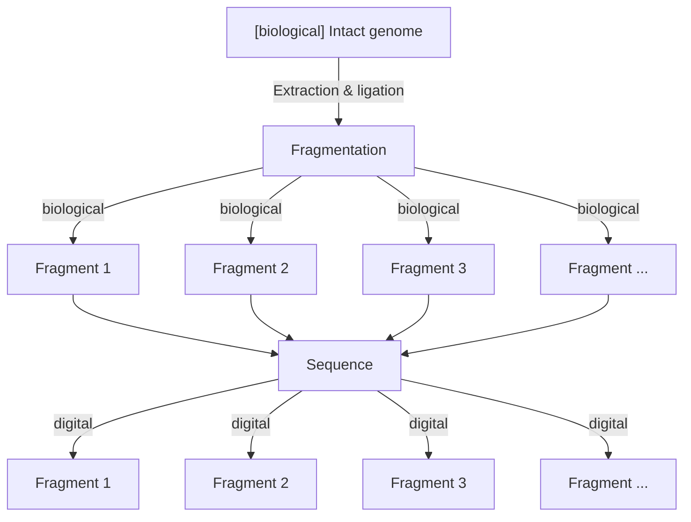
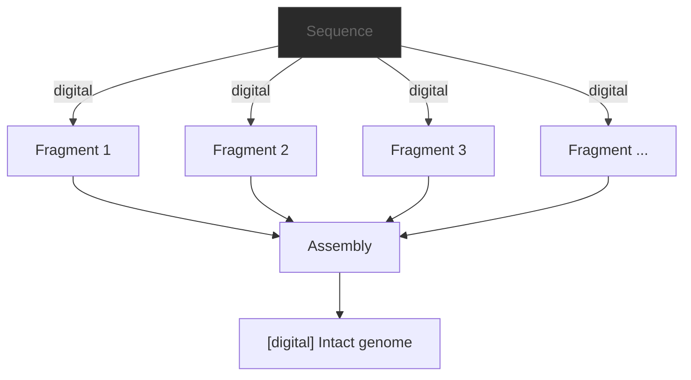

# The Problem
Before we start, we need to understand the actual problem that genome assembly is trying to solve. In the subsequent paragraphs, assume we are dealing with a whole genome sample of a single organism.

## DNA Is Fragile
Inside a cell, we have biological DNA usually in the form of chromosomes. The goal with DNA sequencing is to convert biological DNA into digital form. This means using some kind of instrument to read the chemical bases `Adenine`, `Cytosine`, `Guanine` and `Thymine` and converting them to a digital representation `A`, `C`, `G` and `T`, which is stored in a data file.

The problem with biological DNA is its fragility. It is very, very difficult to conserve the entire chromosome during the different laboratory steps needed for e.g., extraction and ligation. The result is a (still biological) fragmentation of the genome. In other words, we'll have many, many fragments of the genome to deal with during sequencing. Not a single continuous chromosome. In addition, sequencing platforms such as Illumina can't even theoretically sequence an entire chromosome in one singular read due to read length restrictions. This is partially the reason why your FASTQ file contains thousands or millions of shorter reads instead of a few, extremely long reads (although advances in Oxford Nanopore sequencing are approaching this).

In practice, it is a bit more nuanced. E.g., for bacteria we typically don't just sequence DNA from a single cell since this would give us a maximum genome coverage of 1x. We sequence multiple cells from a given colony and treat all this DNA as the <q>genome</q>. 

## Why Assembly Matters
We now have a FASTQ file with thousands or millions of fragments, which are digital representations of the original, biological genome. Now what?

The goal with genome assembly is to computationally re-create the biological genome, using the digital fragments in the FASTQ file. There are several reasons why, such as:
- In bacteria, separating chromosomes from plasmids enables us to investigate plasmid-driven outbreaks.
- Accurately identifying genomic features (such as genes, mobile genetic elements, etc) and their relative distances to each other.
- Large scale characterization of an entire genome (e.g., the [human genome project](https://en.wikipedia.org/wiki/Human_Genome_Project)).
- Comprehensive comparisons between genomes.

As you see in the diagram above, the result from the genome assembly is a digitally re-created version of our original biological genome that hopefully is as closely matching as possible. For reasons we'll cover later on, this is actually quite difficult.

To summarize, the problem is that we have multiple fragments that we'd like to <q>assemble</q> into a more or less complete genome. The solution is to use graph theory.
