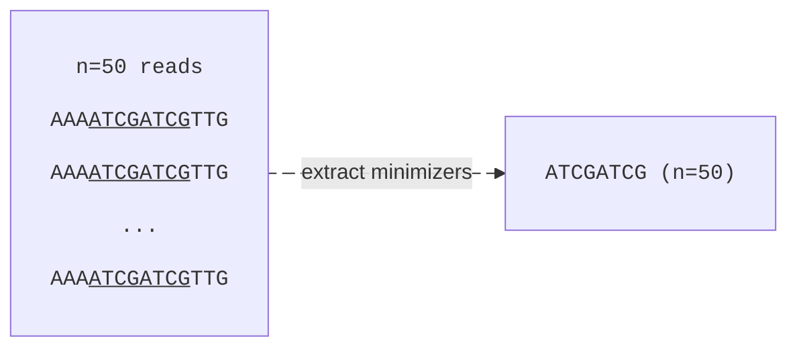
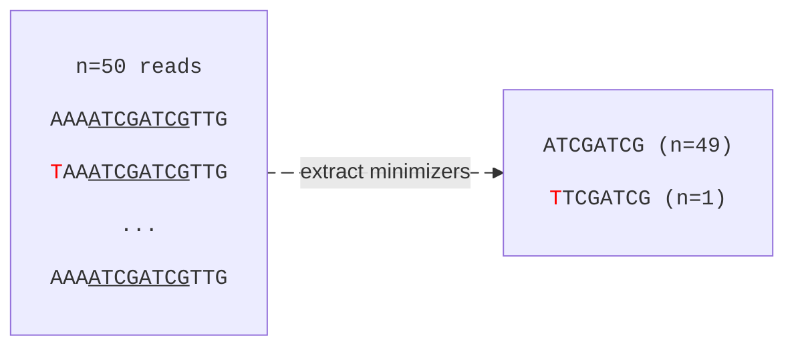
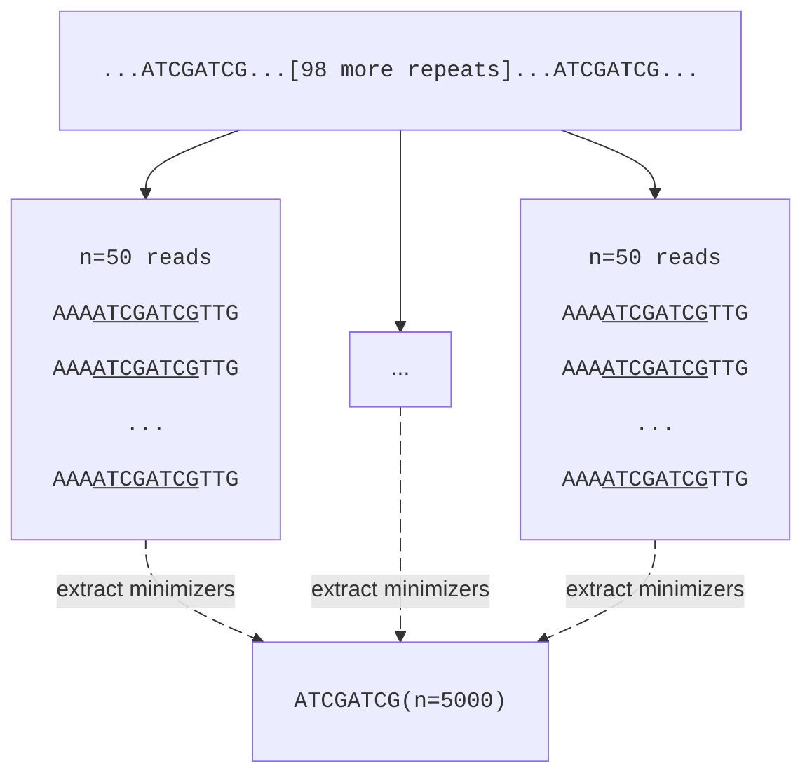

# Using Minimizers
Now that we have a (very) basic understanding of how graphs work it is clear that:
- De Bruijn graphs use kmers as their fundamental building block.
- Overlap graphs also benefit from using kmers, as we'll soon see.

Hence, kmers are central for genome assembly.

## The Problem With Kmers
A slight problem with kmers is that we can generate a lot of them. Theoretically, if we only consider the four canonical nucleotides `{A, T, C, G}` we can generate `4^k` unique kmers for a given kmer size `k`.

| kmer size | possible kmers |
|--|--|
| 1	 | 4					 |
| 11 | 4,194,304			     |
| 15 | 1,073,741,824 		 |
| 31 | 4.6e+18 				 |

For Illumina data, a kmer size of `k=31` is very reasonable and can, in theory, generate a ridiculous number of kmers.

In practice though, we'll never reach the theoretical number of kmers. Mainly because:
- Genomes are not random. If they were, we'd have bigger issues than worrying about kmers.
- Genomes are limited in size. For example, the human genome is *roughly* `3e+9` bp long. If the genome was random, we could have a maximum of

\\[
	3 \times 10^9 - k + 1 \approx 3 \times 10^9
\\]

\\[
	\text{for all } (k + 1) \ll 3 \times 10^9
\\]

Regardless, even if we take ploidy, genome coverage and sequencing errors into consideration, it is still a high number. Especially if we have limited resources in terms of storage and computation.

## Why Minimizers
Revisiting the chapter on [minimizers](../kmers/minimizers.md), we recall that minimizers is a sort of downsampling approach. For a mathematical background on minimizers, please read the [paper](https://doi.org/10.1093/bioinformatics/bth408). Essentially, it enables us to downsample the number of kmers quite aggressively without losing too much information.

The basic idea with minimizers is to look at a number of consecutive kmers and only choosing the lexicographically smallest one. With some clever maths (the formula of which I'm not smart enough to derive), we can define the downsampling factor `d` as:

\\[ 
	d \approx \frac{2}{w + 1}
\\]

Where `w` is the **number of kmers in a given window**. If we increase `w`, we increase the number of kmers for which we find one <q>representative</q> kmer to use as minimizer and hence <q>downsample</q> the pool of kmers.

## Refining The Minimizer Approach
This is good! We have found a way to (thanks to some smart people) intelligently downsample our kmers. However, we are not done quite yet.

Imagine we have a FASTQ file of whole genome sequenced *Escherichia coli* with a mean coverage of `50x`. This means that on average, each position in the `Escherichia coli` genome has a coverage of `50`. Now, also assume that we extract all minimizers for this sample, the **mean** coverage of which will also **approximately** be `50x`.

How do we handle minimizers that are statistically over or under represented? Maybe we have a minimizer with a count of `2`. Maybe we have a minimizer with a count of `10,000`. These would be outliers with respect to the mean. Should we keep or discard those?

### Under represented minimizers
A significantly *underrepresented* minimizer is probably due to sequencing error(s). Consider the figures below, where we pretend we have 50 reads for a specific minimizer region in the genome. In the first figure, we have no sequencing errors. In the second figure, we've introduced an error in the second read. 

With zero errors, we'd expect all 50 reads to generate the minimizer `ATCGATCG`. However, due to a sequencing error we get 49 minimizers `ATCGATCG` and one minimizer `TTCGATCG`.

## Over represented minimizers
Depending on the kmer size, minimizers can occur multiple times in the genome by pure chance. A significantly *overrepresented* minimizer, however, can appear due to repeats. Imagine that our genome contains 100 repeats of a certain sequence in which they share a long enough nucleotide stretch to correspond to the same minimizer. Since each repeat (on average) is covered `50` times, we'd get a minimizer count of `100 * 50 = 5000`.

These overrepresented minimizers are problematic for assembly. Since the same minimizer maps to many locations in the genome, it becomes ambiguous — we can't easily tell which repeat a read actually came from. Additionally, storing and processing these high-frequency minimizers is computationally expensive for questionable benefit. One important remark here is that just because we remove repeat-minimizers does not necessarily mean we'll have gaps in final the assembly. The reason is that there are many more steps to come, such as aligning reads back to the graph. Since reads are longer than the minimizers themselves (in some cases much longer), we can sometimes still resolve these problematic regions.
