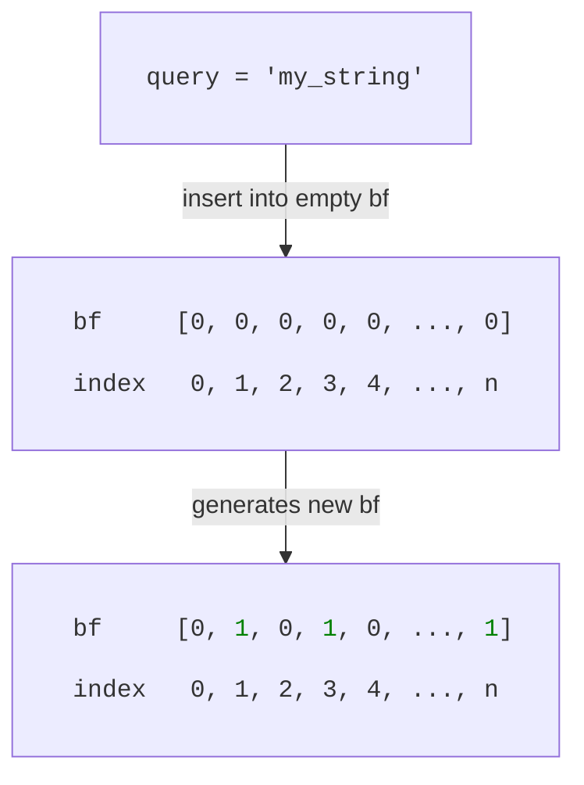
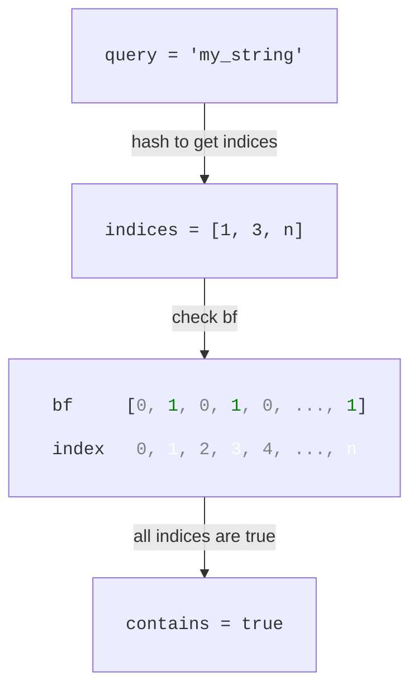

# Bloom Filter
A bloom filter is a probabilistic data structure, kinda similar to a `HashSet` but not really. The goal with a bloom filter is to probabilistically check if an element is contained in a set. It has the following interesting properties:
* We can know for certain if an element is not part of the set.
* We can, with some probability, say that an element is part of the set.

For example, assume we have a string `s` and a bloom filter `bf`. If `bf.contains(s) == false`, we know for certain that `s` is not in the set. If `bf.contains(s) == true`, then `s` is likely in the set (the false positive rate for which is determined by the bloom filter characteristics).

The table below lists some different examples possible outputs.

|Query|Set| `bf.contains(query)` | Query in set? | Type | 
| :-- | :-- | :-- | :-- | :-- |
|s1| {s2, s3, s4} | No | No | True Negative | 
|s2| {s1, s3, s4} | Yes | No | False Positive | 
|s3| {s1, s3, s4} | Yes | Yes | True Positive |

## A Bit of Theory
In essence, a bloom filter is a bit array of type `[bool; n]`. An empty bloom filter has all values set to `0`. When we insert an element, we flip certain indices from `false` to `true`.

In the example below, we insert `"my_string"` into an empty bloom filter, flipping the values at indices `1, 3 and n` from `false -> true`.


How do we know what indices to flip? Bloom filters are based on hashing where a single element generates multiple hash values. These values are our indices, the values of which we flip `false -> true`. In the example above, our hashes (and hence, our indices) are `1, 3, n`.

To check if an element is in the bloom filter, we hash it to get its indices and check if all of them are set to `true`. If any index is `false`, the element is definitely not in the set. If all indices are `true`, the element is probably in the set.



### Parameters
The math is a bit hairy, but based on a false positive rate `p` and the number of elements `m` we expect to insert it is possible to calculate the following parameters:

|Parameter|Description|
| :-- | :-- |
|`n`| The length of our array (number of bits)|
|`k`| The number of hashes (indices per element)|

We can calculate the number of bits `n` as:
\\[ 
	n = -\frac{\text{m} \cdot ln(p)}{ln(2)^2}
\\]

where `m` is the number of elements we expect to insert and `p` is our desired false positive rate. E.g., with `m = 100` and `p = 0.001` we get `n = -100 * ln(0.001) / ln(2)^2 ~ 1438` bits. This means our array will be of type `[bool; 1438]`.

The number of hashes `k` required can now be calculated according to:

\\[
	k = \frac{n}{m} \cdot ln(2)
\\]

With `m = 100` and `n ~ 1438` we get `k = 1438/100 * ln(2) ~ 10`, meaning we need `10` separate hash values per element. We don't really want to use `10` different hash functions though since it is not practical. Instead, we can use two hash functions `h1(x)` and `h2(x)` and derive our hashes as

\\[
	h_i(x) = (h_1(x) + i \cdot h_2(x)) \mod n \quad i = 1, ..., k
\\]

where `mod n` comes from the fact that we need to limit the hash value to the number of elements in our array. 

### Probabilistic Nature
We now see a potential problem - what if the hashes from two different elements overlap? It might happen, because we have a limited number of bits to flip and each element produces `k` hashes.

Maybe `"my_string"` and `"my_string2"` generate hashes `1, 3, n` and `3, 5, 8` respectively.

Or even worse, what if `"my_string_2"` and `"my_string_3"` generate hashes `3, 5, 8` and `1, 4, n`? If we insert `"my_string_2"` and `"my_string_3"` into an **empty** bloom filter, we'd flip indices `1, 3, 4, 5, 8, n`. If we then want to check if `my_string"` (not in the set) is contained, we'd see that indices `1, 3, n` indeed are set to `true`. Not because `"my_string"` was inserted, but because `"my_string_2"` and `"my_string_3"` caused a hash collision, resulting in a false positive.

This is the probalistic nature of bloom filter. Setting `p` to an appropriate value, along with good hash functions reduce hash collisions.

## Code Implementation
For our bloom filter implementation, we only care about functionality. Not speed. We'll use the [murmur3](https://docs.rs/murmur3/latest/murmur3/) crate to generate a 128 bit hash. This is a bit of a <q>hack</q> because we can use it to simulate our two hash functions `h1(x)` and `h2(x)` by mapping the lowest 64 bits to `h1` and the highest 64 bits to `h2`. Unfortunately, murmur3 is not included in the Rust Playground, which is why the code playground is disabled.

In practice, we'd use a crate like [fastbloom](https://crates.io/crates/fastbloom).

```rust,noplayground
use murmur3::murmur3_x86_128;
use std::{fmt::Debug, io::Cursor};

#[derive(Debug)]
struct BloomFilter {
    num_hashes: usize,
    num_bits: usize,
    bit_array: Vec<bool>,
}

#[derive(Debug)]
struct AppError(String);

impl BloomFilter {
    fn new(p: f64, num_elements: usize) -> Result<Self, AppError> {
        if p <= 0.0 || p >= 1.0 {
            return Err(AppError(format!(
                "p must be non-negative and 0.0 < p < 1.0. Provided value: `{}`",
                p
            )));
        }

        let num_bits = -(num_elements as f64 * p.ln() / 2.0f64.ln().powi(2));
        let num_hashes = (num_bits / num_elements as f64) * 2.0f64.ln();

        // Round up to closest int.
        let final_num_bits = num_bits.ceil() as usize;
        let final_num_hashes = num_hashes.ceil() as usize;

        if final_num_bits <= 1 {
            return Err(AppError(format!(
                "Unreasonable number of bits: {}.",
                final_num_bits
            )));
        }

        Ok(Self {
            num_hashes: final_num_hashes,
            num_bits: final_num_bits,
            bit_array: vec![false; final_num_bits as usize],
        })
    }
}

impl BloomFilter {
    fn hashes(&self, element: u64) -> Result<Vec<usize>, AppError> {
        let mut c = Cursor::new(element.to_le_bytes());

        let hash = murmur3_x86_128(&mut c, 1)
            .map_err(|_| AppError(format!("Failed to hash `{}`", element)))?;

        let h1 = hash & 0xFFFFFFFFFFFFFFFF;
        let h2 = hash >> 64;

        let hashes: Vec<usize> = (0u128..self.num_hashes as u128)
            .map(|i| ((h1 + i * h2) % self.num_bits as u128) as usize)
            .collect();

        Ok(hashes)
    }

    pub fn insert(&mut self, element: u64) -> Result<(), AppError> {
        let hashes = self.hashes(element)?;

        hashes.iter().for_each(|hash| {
            self.bit_array[*hash] = true;
        });

        Ok(())
    }

    pub fn contains(&self, element: u64) -> Result<bool, AppError> {
        let hashes = self.hashes(element)?;

        for hash in hashes {
            if !self.bit_array[hash] {
                return Ok(false);
            }
        }

        Ok(true)
    }
}

fn main() -> Result<(), AppError> {
    let mut bf = BloomFilter::new(0.01, 100)?;

    bf.insert(123)?;

    assert_eq!(bf.contains(123)?, true);
    assert_eq!(bf.contains(1235)?, false);

    Ok(())
}
```

## Further Reading

| Paper | Authors | Year | Description |
| :-- | :-- | :-- | :-- |
| [Space/Time Trade-offs in Hash Coding with Allowable Errors](https://dl.acm.org/doi/10.1145/362686.362692) | Burton H. Bloom | 1970 | The original paper introducing bloom filters. Describes the core mechanism of using multiple hash functions to flip bits in a bit array. |
| [Probability and Computing: Randomized Algorithms and Probabilistic Analysis](https://www.cambridge.org/core/books/probability-and-computing/3A5B47DB315FC64B9256C5C8131C5EFA) | Michael Mitzenmacher, Eli Upfal | 2005 | Standard textbook providing formal proofs for the optimisation formulas, including why the false positive rate is minimised when `k = ln(2) * n/m`, which is where the `ln(2)²` denominator comes from. |
| [Less Hashing, Same Performance: Building a Better Bloom Filter](https://onlinelibrary.wiley.com/doi/10.1002/rsa.20208) | Adam Kirsch, Michael Mitzenmacher | 2008 | Proves that only two hash functions are needed. Derives the double hashing formula `h_i(x) = h_1(x) + i * h_2(x) mod m` used in this implementation. |
| [Summary Cache: A Scalable Wide-Area Web Cache Sharing Protocol](https://ieeexplore.ieee.org/document/851975) | Li Fan, Pei Cao, Jussara Almeida, Andrei Z. Broder | 2000 | Derives the false positive probability formula `p ≈ (1 - e^(-kn/m))^k`, which is the formula most commonly used to work backwards to find the optimal `n` and `k`. |
