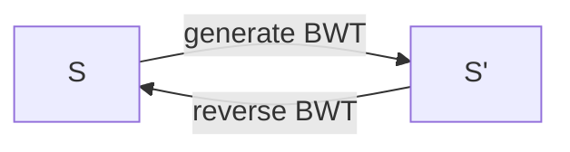
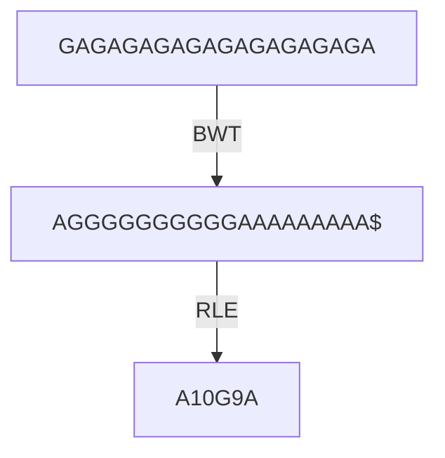
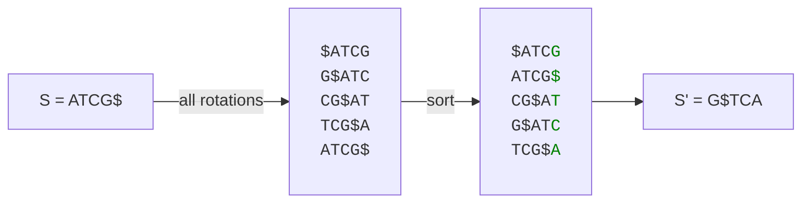
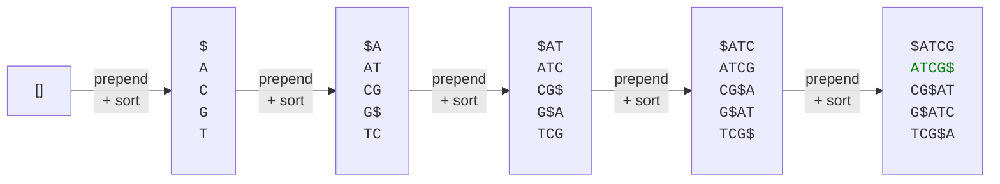
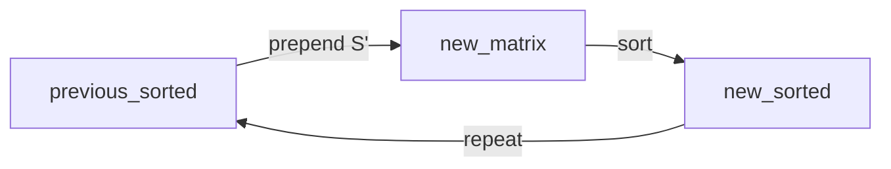

# Burrows Wheeler Transform
Even though the Burrows Wheeler Transform (BWT) might technically not be a data structure, it ended up in this chapter anyways. BWT is a process that transforms a string `S` into another string `S'` in a way such that:
* Runs of similar characters end up closer to each other.
* We can losslessly convert `S'` back to `S`.



The first characteristic is important because if we can increase the number of stretches of identical characters, the string is more easily compressable. For example, the sequence `GAGAGAGAGAGAGAGAGAGA` can be compressed down quite aggressively using BWT and run-length encoding (RLE):



Obviously there is an even better compression for this particular case, which is simply `10GA`. For now however, we'll only deal with BWT and RLE.

## Generating A BWT
The Burrows Wheeler Transform is based on two fundamental concepts - circular rotation and sorting.

*circular rotation* means to allow the string to <q>wrap</q> around itself during rotation. For example, `ATCG` rotated one step to the right would give `GATC`, where the last character `G` wraps around and becomes the first character. The `$` character is commonly used to indicate the end of the original string. E.g., `ATCG$ -> G$ATC`.

The steps for generatinga BWT (`S -> S'`) are:
1. Generate a matrix where each row `i` is a subsequent rotation of `S` and each column `j` is the character `j`th character for the rotation `i`.
2. Sort by row. E.g., `ATCG < GATC`, etc.
3. Concatenate the last character in each column to get the BTW `S'`.   



> [!NOTE]
> In the example above, the BWT does not really help us that much because the original string `ATCG` only consists of four (unique) characters. For longer strings however, a BWT can be hugely beneficial.

## Reversing A BWT
To reverse our BWT into the original string `S`, we follow these steps:
1. Start with an empty matrix
2. Add the transform `S'` as a **column**.
2. Sort the matrix by row.
3. *Prepend* the original `S'` to the sorted matrix.
4. Repeat steps 2 and 3 `len(S') - 1` more times.
5. Find the row that ends with `$`. This is the original string `S`. 

In our example, it would look something like the image below. Note that each step in the graph below both prepends *and* sorts.



Schematically, we can think of the reversal as an iterative process.



## A Bad Implementation
There are several clever ways to implement very efficient BWTs, usually including [suffix arrays](https://en.wikipedia.org/wiki/Suffix_array). For the sake of just understanding BWTs, we won't worry about performance and just implement a working prototype.

```rust,editable
fn bwt(s: &str) -> String {
    let mut seq = s.chars().collect::<Vec<_>>();

    let mut rotations: Vec<Vec<char>> = Vec::with_capacity(seq.len());

    // All rotations.
    (0..seq.len()).for_each(|_| {
        seq.rotate_right(1);
        rotations.push(seq.clone());
    });

    rotations.sort();

    let bwt_transform = rotations.iter().map(|r| r[r.len() - 1]).collect::<String>();
    bwt_transform
}

fn reverse(bwt: &str) -> String {
    let seq = bwt.chars().collect::<Vec<_>>();

    let mut concats: Vec<String> = vec![String::new(); bwt.len()];

    for _ in 0..seq.len() {
        seq.iter().enumerate().for_each(|(i, s)| {
            concats[i] = format!("{}{}", s, concats[i]);
        });
        concats.sort();
    }

    let original = concats.into_iter().find(|c| c.ends_with('$')).expect("failed to find reversed BTW.");

    original
}

fn main() {
    let s = "GAGAGA$";
    println!("original: {:?}", &s);

    let transform = bwt(s);
    println!("BWT: {:?}", &transform);

    let reversed = reverse(&transform);
    println!("Reversed: {:?}", reversed);
}
```

An excellent crate that supports multiple bioinformatic data structures, including suffix arrays and BWT, is the [bio](https://docs.rs/bio/latest/bio/) crate.
