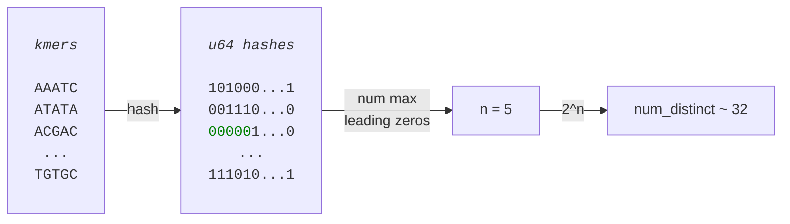
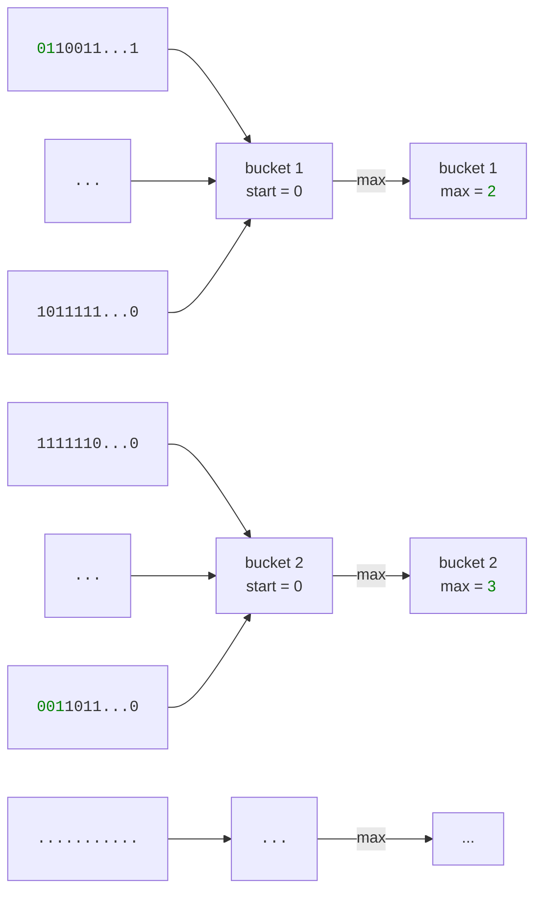

# HyperLogLog
Consider the following problem - we want to count the number of distinct elements based on some data. For example, given a FASTQ file count the distinct number of kmers. The solution seems trivial - we just generate all kmers, store them in a `HashSet` and calculate the length of the final set.

How would this solution play out for a FASTQ file which contains `10^11` (a hundred billion) bases if you are required keep the kmers in memory? Assume that the mean read length is `100bp` and we use a kmer size of `21`. The total number of kmers (including duplicates) we can generate is approximately

\\[
	N_{\text{reads}} * N_{\text{kmers_per_read}} = \frac{10^{11}}{100} \cdot (100 - 21 + 1) \approx 80 \cdot 10^{9} 
\\]

If every kmer is encoded as a `u64`, we need 8 bytes of storage per kmer which equates to approximately `640Gb` of RAM. In addition, we have sequencing errors that will introduce additional, spurious kmers. This math is far from ideal because we have many factors that will drastically reduce the number of kmers such as genome coverage, genome size and repeat regions. Regardless, we might end up using way more memory than we'd like - especially for large genomes.

We want an efficient way to *approximate* the number of distinct kmers without having to store them explicitly.

## A Bit Of Theory
[HyperLogLog](https://en.wikipedia.org/wiki/HyperLogLog) is a probabilistic estimator of the distinct number of elements in a multiset. E.g., the multiset `{A, A, C, C, C, G}` has three distinct elements.


The HyperLogLog has some interesting properties that we won't derive, but rather only define and trust. If this is of interest to the reader, a lot of the mathematical background is defined in the [paper](https://algo.inria.fr/flajolet/Publications/FlFuGaMe07.pdf).

Assuming random numbers of a uniform distribution, the distinct number of elements can be approximated by the maximum amount of leading zeros from the binary representations of these numbers. More precisely, if the maximum number of leading zeros (among the binary represented elements) found is `n`, then we can approximate the number of distinct elements as `2^n`.

This might sound a bit abstract, to let's make it a bit more concrete. In a bioinformatic context, assume we have extracted a number of kmers (k=5). If we apply a hash function to each kmer, converting them to `u64` values, and extract the `u64` with the highest number of leading zeros as `n`, then the number of distinct kmers is approximately `2^n`.



We need to apply some refinements based on the [paper](https://algo.inria.fr/flajolet/Publications/FlFuGaMe07.pd). First, we actually need to redefine `n` to not be the maximum number of leading zeros but rather the 1-based index of the rightmost `1` after the longest stretch of leading zeros. In our case, we just need to calculate `n += 1`. See examples below.

|hash| n|
| :-- | :-- |
|<font color=white>0001</font>| 4|
|<font color=white>01</font><font color=gray>00</font>| 2|
|<font color=white>1</font><font color=gray>000<font>| 1|

Second, we need to make our approximation more robust towards variance in the data. Instead of just extracting one `n` from the entire dataset, we create a number of <q>buckets</q> and map each hash to one of these buckets. We calculate `num_leading_zeros` for the hash, compare it to the value in the bucket and calculate `bucket_value = max(num_leading_zeros, bucket_value)`. See a schematic example below.




Another nice feature of using buckets is that the accuracy of our estimate improves as `m` increases. The approximate error of our estimate can be calculated as:

\\[
	error \approx \frac{1.04}{\sqrt{m}}
\\]

Where `m` is the number of buckets. E.g., using `10,000` buckets gives an approximate error of

\\[
	error \approx \frac{1.04}{\sqrt{10000}} \approx 0.01 = 1\text{%}
\\]

A natural next question would be - how do we estimate the number of distinct elements from `m` buckets? We said that `n^2` is an approximation when using a single value. In this case, we have `m` values that need to be considered. Without diving into the details, it turns out that the [harmonic mean](https://en.wikipedia.org/wiki/Harmonic_mean) is a good method. Briefly, the harmonic mean is defined as

\\[
	\frac{M}{\sum_{i=1}^{M}{\frac{1}{x_{i}}}}
\\]

In our case, `xi` is the value for bucket `i` and `i = {1, .., m}`. Assuming `bucket` is of type `Vec<usize>`, applying the harmonic mean gives us the estimate as

\\[
	estimate = M \cdot \frac{M}{\sum_{i=1}^{M}{{2^{-\text{bucket[i]}}}}} 
\\]

Basically, we multiply the number of buckets with the mean of each bucket.

Finally, we also need a way to map each `u64` hash to a bucket index. One easy way is to take the first `p` bits of the hash and use that as the index. This gives us `2^p` different indices which means that `m` must relate to `p` as

\\[
	m = 2^{p}
\\]

and we must enforce that `m` is a power of 2. This leaves us with the `64-p` bits left (if using a `u64` hash) to check for leading zeros.


## Code Implementation
The HyperLogLog paper also describes a few more terms to account for bias, etc. These are included in the code below, but are not covered in this chapter.

```rust,editable
use std::collections::hash_map::DefaultHasher;
use std::hash::{Hash, Hasher};

/// m - number of buckets
/// p - the number of bits to use for bucket indexing.
///
/// m and p relate through m = 2^p
#[derive(Debug)]
struct HyperLogLog {
    m: usize,
    p: usize,
    buckets: Vec<usize>,
}

impl HyperLogLog {
    fn new(err: f64) -> Self {
        if err <= 0.0 || err >= 1.0 {
            panic!("err must be positive and less than 1.0")
        }

        let m_required = (1.04 / err).powi(2);
        let p = m_required.log2().ceil() as usize;
        let m = 2_usize.pow(p as u32);

        Self {
            m: m,
            p: p,
            buckets: vec![0; m],
        }
    }

    fn add(&mut self, i: u64) {
        let mut h = DefaultHasher::default();
        i.hash(&mut h);
        let hash = h.finish();

        // Use the first p bits to decide bucket index.
        let index = (hash >> (64 - self.p)) as usize;

        // Find num leading zeros in the remaining part.
        let remainder = hash << self.p;
        let count = (remainder.leading_zeros() + 1) as usize;

        // Increment if larger.
        if count > self.buckets[index] {
            self.buckets[index] = count;
        }
    }

    /// Calculate the harmonic mean as a proxy for num distinct elements.
    fn num_distinct(&self) -> f64 {
        let m_f64 = self.m as f64;
        let corr = 0.7213 / (1.0 + 1.079 / m_f64);

        let inv_sum = self
            .buckets
            .iter()
            .map(|&val| 2.0_f64.powi(-(val as i32)))
            .sum::<f64>();

        let est = corr * m_f64 * m_f64 / inv_sum;
        let zero_buckets = self.buckets.iter().filter(|i| **i == 0).count();

        if est > 2.5 * m_f64 || zero_buckets == 0 {
            return est;
        }

        return m_f64 * (m_f64 / zero_buckets as f64).ln();
    }
}

fn main() {
    let hll = HyperLogLog::new(0.01);

    // modify code here
}
```

As always, we'd prefer to use a high performance crate, such as [hyperloglockless](https://github.com/tomtomwombat/hyperloglockless) in real life applications.
