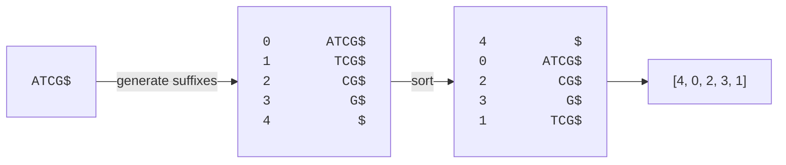
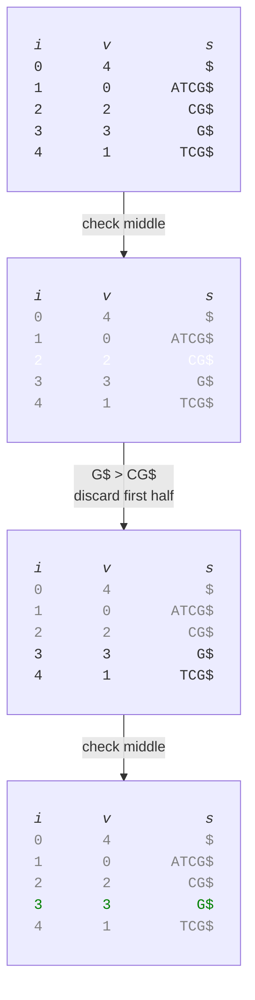

# Suffix Array
To be honest, suffix arrays took me an embarassingly long time to understand. However, the strength of this structure is its efficiency in text search. Since nucleotide sequences are strings (of very few unique letters), we can use suffix arrays to find sequence matches.

In essence, a suffix array is just an integer array that stores the positions of all suffixes of the string *in sorted order*. Since the suffixes are sorted, be can run queries in `O(log n)` time with a binary search approach.

## Constructing A Suffix Array
First, we need to look at how to construct a suffix array for a sequence `ATCG$`. We use the `$` character to indicate the end of the string, which will turn out to be useful. The steps we'll use are:
1. Generate all suffixes and their corresponding index `(index, suffix)`.
2. Sort by suffix.
3. Extract the indices. 

For our sequence `ATCG$`, we get the following ordered suffixes, assuming 0-based indexing

|index| suffix|
| :-- | :-- |
|0| ATCG$|
|1| TCG$|
|2| CG$|
|3| G$|
|4| $|


The graph below shows the construction of the entire suffix array, which results in `[4, 0, 2, 3, 1]`.



The key is to understand that even though the array integers appear in a seemingly arbitrary order, the suffix themselves are sorted. We see this by extracting every suffix from the suffix array.

|suffix pos| extract| result|
| :-- | :-- | :-- |
|4| s[4..]| $|
|0| s[0..]| ATCG$|
|2| s[2..]| CG$|
|3| s[3..]| G$|
|1| s[1..]| TCG$|

> [!NOTE]
> For very long strings we'll hit a computational limit by using the naive approach explained above. We cannot possibly keep every suffix sequence in memory because the number of possible suffixes we can create is:
> \\[
> 	\sum_{1}^{N}{i} = \frac{N \cdot({1 + N})}{2}
> \\]
> which is a ridiculous number for e.g., the human genome.

## Code Implementation
Since our example sequence `ATCG$` is so short, we can codify the <q>naive</q> approach for constructing a suffix array. See the last section in this chapter for a more efficient approach, based on induced sorting.

```rust
fn suffix_array(s: &str) -> Vec<usize> {
    let mut v = (0..s.len()).map(|i| (i, &s[i..])).collect::<Vec<_>>();
    v.sort_by_key(|element| element.1);
    
    v.iter().map(|element| element.0).collect()
}

fn main() {
    let s = "ATCG$";

    let sa = suffix_array(s);
    println!("suffix array: {:?}", &sa);
    
    assert_eq!(&s[sa[0]..], "$");
    assert_eq!(&s[sa[1]..], "ATCG$");
    assert_eq!(&s[sa[2]..], "CG$");
    assert_eq!(&s[sa[3]..], "G$");
    assert_eq!(&s[sa[4]..], "TCG$");
}
```

## Querying A Suffix Array
To query a suffix array, we can use a binary search approach. Assume that we've built a suffix array for `ATCG$` that resulted in `[4, 0, 2, 3, 1]` and want to check if `G$` is in the index. First, we'd check the value in the middle of the array, which is at index `2` and has the value `2`, which corresponds to the suffix `CG$`. Since our query `G$` is larger, we can discard all elements up to index `2`.




Can we only query for suffixes? Actually, no. We can query for any arbitrary string due to the following property: *every substring of a string must be a prefix of some suffix*. What this means is that any **valid** substring has the property `some_suffix.starts_with(valid_substring) = true`. For example, `TC` is a valid substring of `ATCG$` and there is one suffix `TCG$` that satisfies this because `"TCG$".starts_with("TC") = true`. This means that for arbitrary strings, we can query the suffix array in a very similar way to what we did in the above example.

## Suffix Arrays In Practice
Codifying efficient suffix array implementations are out of scope and realistically, I'd take me forever to understand it well enough to codify it anyways. With that said, it is possible to construct a suffix array in linear time using [Suffix Array Induced Sorting](https://doi.org/10.1109/DCC.2009.42).
