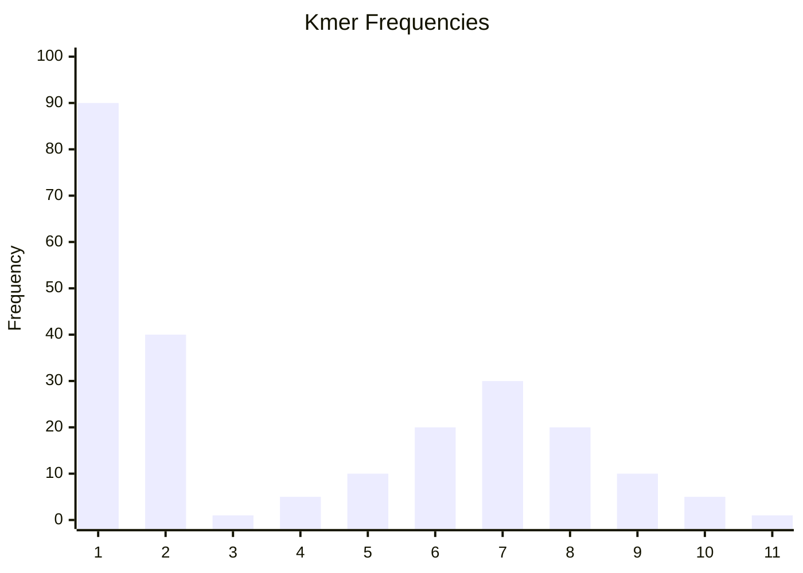

# Deriving The Genome Size
We'll continue with our overly optimistic and made up histogram.

Ignoring the sequencing error peak, we see another peak at `(7, 30)`. Assuming a normal distribution, this would be the mean value *μ*. What does this actually mean? It means that a kmer count of `7` is the average kmer count in our sample. We now have an estimate of the *mean genome coverage*. Following the equation defined previously, we get

\\[
	\bar{G} = \frac{N}{\bar{C}}
\\]

Where `G` is the estimated genome size, `C` is our estimated mean genome coverage and `N` is the number of bases. What we do know is the total number of kmers. For example, the point `(7, 30)` means we have `30` observations of distinct kmers that appear `7` times (a total of `210`). We can therefore derive the formula:

\\[
	\bar{G} = \frac{\sum_{i=i_{min}}^{\infty} i \cdot f_i}{\bar{C}}
\\]

Where `i` is the kmer count index, `i_min` is the minimum index to include (enables us to exclude the sequencing error peak) and `f_i` is the ith frequency.

In our example, we'd set `i_min` to `3` to exclude both the count-1 and count-2 error peaks. The estimated genome size would therefore be:

\\[
	\bar{G} = \frac{3 \cdot 1 + 4 \cdot 5 + \ldots + 11 \cdot 1}{\bar{C}} = \frac{714}{7} = 102
\\]

102bp is a rather small genome size, but we also just made up the data for our histogram so it kinda makes sense.
