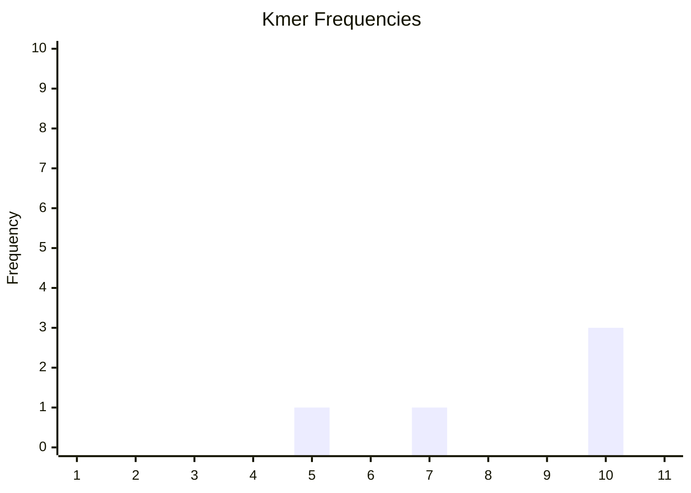
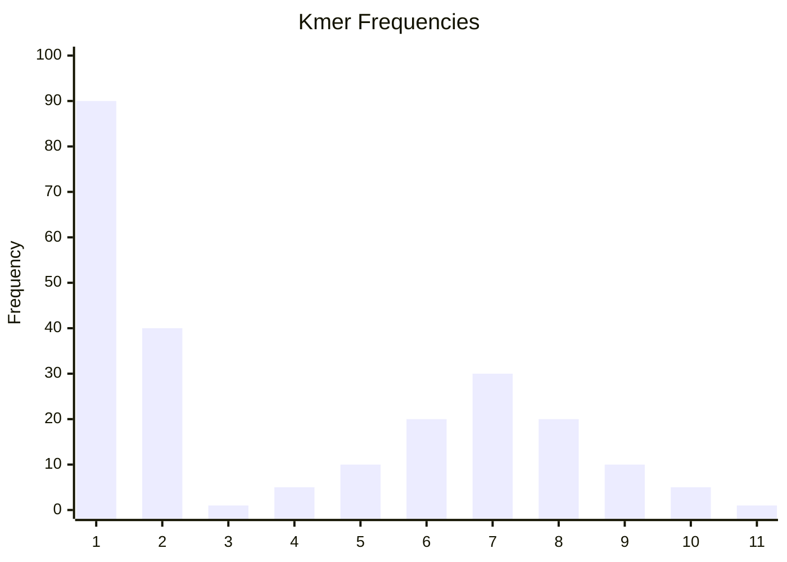

# Kmer Frequencies
We know what kmers are. We don't really know what the term <q>frequencies</q> means in this particular context. To clarify this, we need to understand what a *kmer histogram* is.

## Kmer Histogram
A kmer histogram (also called a kmer frequency spectrum) is a clever, but initially rather confusing way of summarizing the kmer content. Usually, this is visualized as a histogram where:
- The x-axis signifies **kmer counts**. E.g., a value of `10` means <q>kmers that have a count of 10</q>.
- The y-axis signifies **kmer frequencies**. E.g., a value of `100` means that exactly `100` kmers had this count.

This is probably still confusing so let's try to be even more clear. A point `(x, y) = (10, 100)` means that in our sample, exactly `100` unique kmers had a count of `10`.

For example, assume we kmerize our entire sample with `k=5` and count every kmer. Maybe we'd get something like this:

| kmer | count |
|--|--|
| AAATG | 5 |
| AACGT | 7 |
| ATCGT | 10 |
| CGATG | 10 |
| CTTAG | 10 |

When we create our histogram, we'd get the points `(5, 1)`, `(7, 1)` and `(10, 3)` because we have one kmer that occurs 5 times, one kmer that occurs 7 times and three kmers that occur 10 times. Using an array, we could show this as:

```
[0, 0, 0, 0, 1, 0, 1, 0, 0, 3, ...]		y-value (frequency)
[1, 2, 3, 4, 5, 6, 7, 8, 9, 10, ...]		x-value (kmer_count)
```

Note that since we disregard `kmer_count = 0`, there is a -1 offset between the actual array index and the `kmer_count` values. E.g., `kmer_count = 1` is located at index `0`.



## The Reality
The truth is, sequencing data is messy. We have to deal with things such as:
- Biases in GC rich regions.
- Sequencing errors.
- Genomic repeat regions.
- Poly ploidy.

Because of this, the maths (I think) becomes a bit complex and I don't fully understand every aspect of it. The good news is that there is a lot of good reading resources available:

| paper | year | link |
|--|--|--|
| Genomic mapping by fingerprinting random clones: A mathematical analysis | 1988 | [doi](https://doi.org/10.1016/0888-7543(88)90007-9) |
| GenomeScope: fast reference free genome profiling tool | 2017 | [doi](https://doi.org/10.1093/bioinformatics/btx153) |
| GenomeScope 2.0 and Smudgeplot for reference-free profiling of polyploid genomes | 2020 | [doi](https://doi.org/10.1038/s41467-020-14998-3) |
| A fast, lock-free approach for efficient parallel counting of occurrences of k-mers | 2011 | [doi](https://doi.org/10.1093/bioinformatics/btr011) |

Anyways - it turns out that if we have a reasonable well-behaved sample with relatively low coverage of a haploid genome that contains some sequencing errors and negligible repeats, our kmer histogram could look something like the plot below. Keep in mind that this is not real data but rather just a made up example to illustrate the concepts.



We see two distinct patterns - a *spike* for low kmer counts, followed by a *bell curve* like shape.

The *spike* can be attributed to sequencing errors. If errors are random and relatively rare, the sample will contain lots of erroneous kmers of count 1. For example, assume the genome contains a completely unique region `...AAAAA...` that we sequence to a depth of 50x. If we count the kmers in the FASTQ file, we'd assume to find `AAAAA` 50 times if there are no sequencing errors. With random sequencing errors, we all of a sudden have one or a few erroneous kmers. Maybe one `AAAAT` (erroneous) and fourty-nine `AAAAA` (correct). If we extrapolate this concept across the entire genome, these one-count or low-count kmers accumulate into the spike we see in the histogram above. Can we attribute only sequencing errors to the spike? Absolutely not. For example, Illumina data is notoriously uneven coverage wise. If we, by chance, correctly sequence the region `...AAAAA...` with a coverage of 1, it will also end up in the spike.

The *bell curve* can be attributed to the [central limit theorem](https://en.wikipedia.org/wiki/Central_limit_theorem). If we assume the sequencing process to be random and the sequencing reads to be independent, the coverage at any position in the genome follows the poisson distribution (see reading resources in the table above). The problem with kmers is that they are not independent, at least not within a single read. If we know the first kmer of length `k`, we know the `k-1` bases of the next kmer and so on. This non-independence, however, is *local* to the read. In the histogram, we aggregate kmers from many, many independent reads. The result is something that resembles the normal distribution. I'm sure there is some paper out there that has shown this to be mathematically valid.

To refer back to the beginning - sequencing data is messy. We have more things to worry about in addition to sequencing errors. For this reason, many excellent tools for genome size estimation exist out there. For the sake of simplicity however, we'll continue to assume that our data is relatively well behaved.
