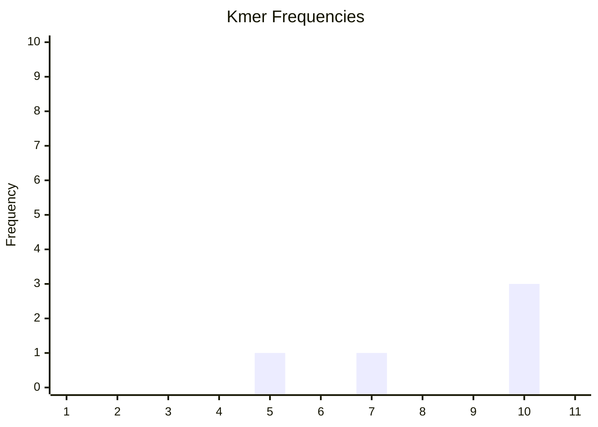

# Kmer Frequencies
We know what kmers are. We don't really know that the term <q>frequencies</q> mean in this particular context. To clarify this, we need to understand what a *kmer histogram* is.

## Kmer Histogram
A kmer histogram (also called a kmer frequency spectrum) is a clever, but initially rather confusing way of summarizing the kmer content. Usually, this is visualized as a histogram where:
- The x-axis signifies **kmer counts**. E.g., a value of `10` means <q>kmers that have a count of 10</q>.
- The y-axis signifies **kmer frequencies**. E.g., a value of `100` means that exactly `100` kmers had this count.

This is probably still confusing so let's try to be even more clear. A point `(x, y) = (10, 100)` means that in our sample, exactly `100` unique kmers had a count of `10`.

For example, assume we kmerize our entire sample with `k=5` and count every kmer. Maybe we'd get something like this:

| kmer | count |
|--|--|
| AAATG | 5 |
| AACGT | 7 |
| ATCGT | 10 |
| CGATG | 10 |
| CTTAG | 10 |

When we create our histogram, we'd get the points `(5, 1)`, `(7, 1)` and `(10, 3)` because we have one kmer that occurs 5 times, one kmer that occurs 7 times and three kmers that occur 10 times. Using an array, we could show this as:

```
[0, 0, 0, 0, 1, 0, 1, 0, 0, 3, ...]		y-value (frequency)
[1, 2, 3, 4, 5, 6, 7, 8, 9, 10, ...]		x-value (kmer_count)
```

Note that since we disregard `kmer_count = 0`, there is a -1 offset between the actual array index and the `kmer_count` values. E.g., `kmer_count = 1` is located at index `0`.


