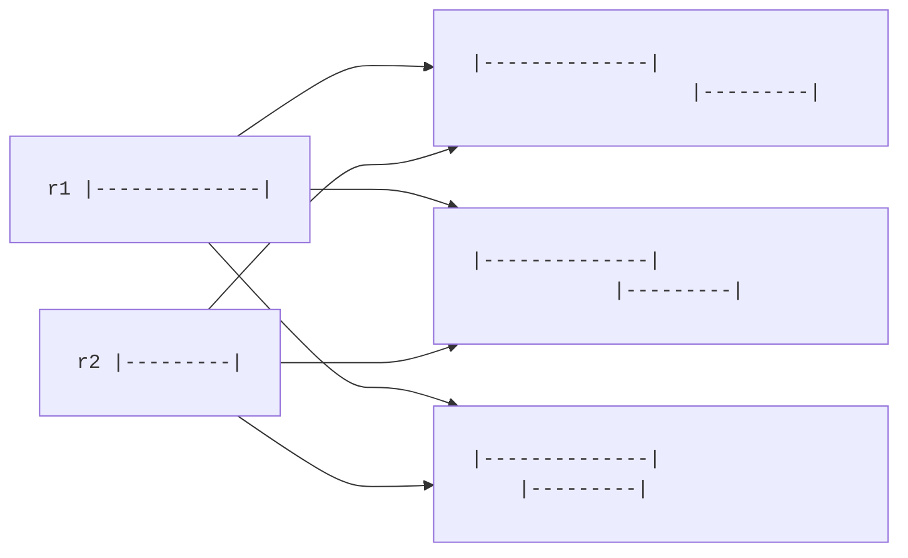

# Manipulating
Sometimes, we want to process and manipulate the BED entries. For example, if we have overlapping coordinates we might want to merge them (either within a file or across multiple files).

There are multiple excellent tools for this, such as [bedtools](https://bedtools.readthedocs.io/en/latest/). Here, we'll go through a bit of theory and then create a basic Rust implementation.

## Sorting
It is significantly easier to handle a sorted BED file than an unsorted one. By sorted, we mean sorted in ascending order by the start (and possibly the end) coordinate.

Due to sorting, regions that are (potentially) overlapping are located adjacent in the file.

In the table below, we can easily identify the three first regions as overlapping.

|chrom|start|end|
| :-- | :-- | :-- |
|chr1|5|20|
|chr1|10|100|
|chr1|50|150|
|...|...|...|

Time complexity wise, we can identify and merge overlaps in `O(n)` time when the coordinates are sorted. This is significantly faster than the brute force `O(n²)` complexity for an unsorted file.

> [!NOTE]
> Sorting itself usually has a time complexity of `O(n log n)`. This means that sorting + finding overlaps effectively runs at `O(n log n)`, which is still a lot better than `O(n^2)`.

We define two regions `r1` and `r2` as sorted if:

\\[
r1_\text{start} <= r2_\text{start}
\\]

## Overlaps
A BED region `(start, end)` can be viewed as a set because it *represents* the monotonically increasing, sorted, unique integer set `{start, start + 1, ..., end - 1}`, where `start <= end`.

If we have two *sorted* regions `r1` and `r2`, we have a few different scenarios:
* `r1` does not overlap with `r2` when `r1_end < r2_start`
* `r1` and `r2` overlap when the suffix of `r1` overlaps with the prefix of `r2` when `r1_end >= r2_end`.
* `r2`is entirely contained within `r1` because `r2_start >= r1_start` AND `r2_end <= r1_end`.



We can write a bit of Rust code to test this. For now, we'll only care about the coordinates and ignore both the chromosome and strand.
```rust
#[derive(Debug, PartialEq, PartialOrd)]
struct BedEntry {
    start: usize,
    end: usize,
}

impl BedEntry {
    fn new(start: usize, end: usize) -> Self {
        if start > end {
            panic!("`start` cannot be greater than `end`");
        }
        Self { start, end }
    }

    fn overlaps(&self, other: &BedEntry) -> bool {
        if self.start > other.start {
            panic!("`other` must be >= self.")
        }

        self.end >= other.start
    }
}

fn main() {
    let r1 = BedEntry::new(1, 10);

    assert_eq!(true, r1.overlaps(&BedEntry::new(1, 10))); // same
    assert_eq!(true, r1.overlaps(&BedEntry::new(10, 20))); // overlap or not???
    assert_eq!(true, r1.overlaps(&BedEntry::new(5, 10))); // r2 is subset of r1.
    assert_eq!(true, r1.overlaps(&BedEntry::new(5, 15))); // suffix of r1 overlaps with prefix of r2.
    assert_eq!(true, r1.overlaps(&BedEntry::new(5, 20))); // suffix of r1 overlaps with prefix of r2.
    assert_eq!(false, r1.overlaps(&BedEntry::new(11, 20))); // no overlap.
}
```

> [!WARNING]
> Using `#[derive(PartialEq, PartialOrd)]` is sometimes useful when one wants to avoid writing boilerplate code. Just be aware what this means. For example, if we test `r1 < r2` then Rust will first check `r1.start < r2.start`. If they are equal, it'll check `r1.end < r2.end`. This is especially dangerous if we'd later add a field `chrom: String`, because we'd potentially get unexpected results for `r1.chrom < r2.chrom`.

Our code still has a fatal flaw (except for the fact that we ignored chromosome and strand), namely the comparison between `r1.end` and `r2.start`. For example, `r1 = (1, 10)` and `r2 = (10, 20)` would, according to our code, overlap. However, we previously said that `end`-values are exclusive. This means we'd actially want to check `r1.end - 1 >= r2.start` or, equivalently, `r1.end > r2.start`

### Generalized Overlaps
If we can't guarantee that `r1` and `r2` are sorted, we need a generalized approach to finding overlaps. Instead of thinking about all the ways `r1` and `r2` *can* overlap, let's think about how they *can't* overlap. There are only two ways, which is when there is a gap between them.

In the first case, we see that `r1.end < r2.start`.
<pre>
r1 |--------------|
r2 			|---------|
</pre>

In the second case, we see that `r2.end < r1.start`.
<pre>
r1 			|--------------|
r2 |---------|
</pre>

Either of these cases means we *don't* have an overlap. With some logical operators, and using [De Morgan's laws](https://en.wikipedia.org/wiki/De_Morgan%27s_laws), we get

\\[ 
	overlap = \lnot(r1.end < r2.start \lor r2.end < r1.start) = r1.end >= r2.start \land r2.end >= r1.start
\\]

```rust
struct Range{
	start: usize,
	end: usize
}

impl Range{
	fn overlaps(&self, other: &Range) -> bool{
		self.start < other.end && other.start < self.end
	}
}

fn main(){
	let r1 = Range{start: 100, end: 200};
	
	assert_eq!(true, r1.overlaps(&Range{start: 100, end: 200})); // same.
	assert_eq!(true, r1.overlaps(&Range{start: 110, end: 190})); // contained.
	assert_eq!(true, r1.overlaps(&Range{start: 150, end: 250})); // suffix-prefix overlap.
	assert_eq!(true, r1.overlaps(&Range{start: 50, end: 150}));  // prefix-suffix overlap.
	assert_eq!(false, r1.overlaps(&Range{start: 50, end: 90}));  // no overlap.
	assert_eq!(false, r1.overlaps(&Range{start: 210, end: 300}));  // no overlap.
}
```


## Operations
Since we view BED regions as sets, we can apply [set operations](https://en.wikipedia.org/wiki/Set_(mathematics)) to these regions. The table below shows three common operators - union, difference and intersection.

<pre>
r1	  	|-----|
r2	     	   |---------|

Union	  	|------------|
Difference      |--|
Intersect	   |--|
</pre>

**Union** is interpreted as <q>merging</q> regions `r1` and `r2` into a single region.

**Difference** is interpreted as keeping the positions in `r1` that are not present in `r2`.

**Intersection** is interpreted as keeping the positions that are shared between `r1` and `r2`.

> [!NOTE]
> In this context, set operations are only logically applicable if `r1` and `r2` overlap. Otherwise:
>
> `Union` would include everything between `r1` and `r2`.
> `Difference` would be equivalent to `r1`.
> `Intersection` would be empty.
