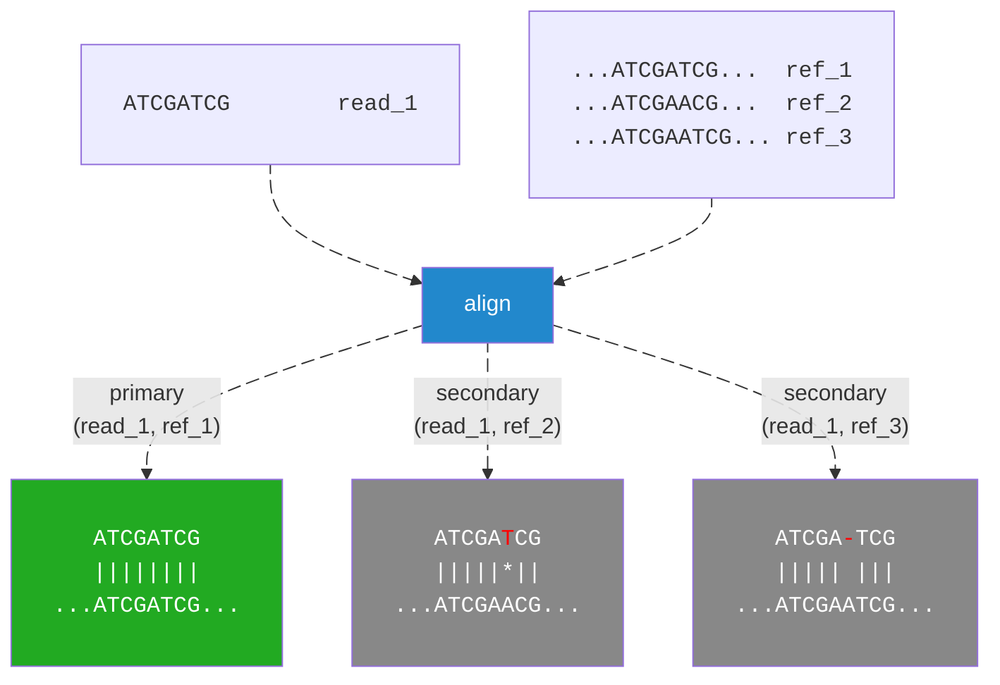
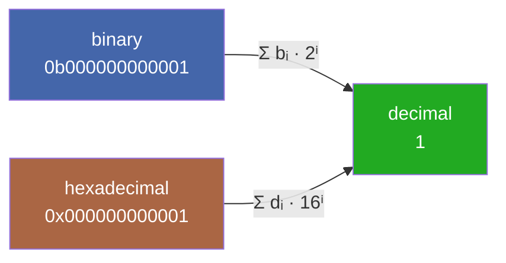
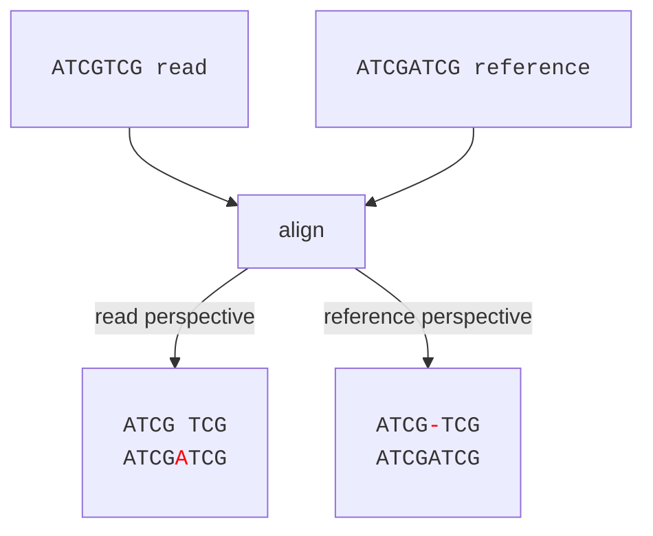
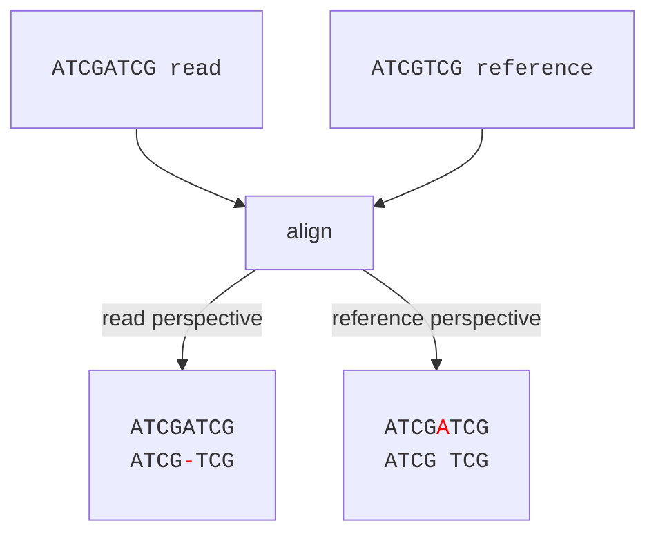

## Terminology
Before we dive into the details of the SAM format, it probably makes sense to clarify some terms.

We'll refer to an *alignment* collectively as anything related to when a region of our query (read) matches a region in the reference sequence. In the example below, we have an alignment with mostly matches, one mismatch and one deletion. We also see that the entire read (from start to end) is aligned. This is not always the case. We could have only a part of the read that aligns to the reference.

<pre>
   GGGGGAAAACTTT-CCC		Read
   |||||||||*||| |||
ATCGGGGGAAAATTTTCCCCATCG	Reference
</pre>

We'll refer to *softmasking* as the part of a sequence which is not part of the actual alignment. This usually happens with alignments at the ends of sequences, such as in the example below. It so happens that the end of the read aligns to the start of our reference sequence. We use softmasking to show the part of the read that is not included in the alignment.

<pre>
atcgatcgTTTTAATA			Read
	||||||*|
	TTTTAAAACTCT...			Reference
</pre>

With that said, softmasking is useful for filtering out <q>suspicious</q> alignments. Consider the example below, where both ends of the read are softmasked.

<pre>
	    acgtgAAGGTTGGAACatgccagt
	         |||||||||||
ACCCAGTATCGGGTTCCAAGGTTGGAACGATAGAGCGAGT
</pre>

This alignment is indeed a bit suspicious. It might be the case that the masked regions are sequencing artifacts (such as barcodes). Or, it is the case that the read actually does not belong here (spurious alignment). Softmask filtering is used by software such as [samclip](https://github.com/tseemann/samclip).

We refer to `hardmasking` as the practice of replacing masked bases with `N` characters, rather than lowercasing them. Unlike softmasking, the original sequence is lost.

## Fields
Each alignment, which is a row in the SAM file, consists of *at least* 11 tab-separated fields:
1. `Query name` - in our case, this is the read id.
2. `Alignment flag` - bitwise flag that shows the type of alignment.
3. `Template name` - in our case, this is the contig name.
4. `Mapping pos` - the leftmost mapping position that consumes the reference.
5. `Mapping quality` - a phred score that encodes mapping quality (probability that mapping position is incorrect).
6. `CIGAR string` - a string with alignment information such as matches, mismatches, etc.
7. `Mate name` - the name of the mate read. Applicable to paired-end reads.
8. `Mate position` - the position of the mate read. Applicable to paired-end reads.
9. `Template length` - applicable to paired-end reads. Infers the length of the read fragment (since pe1 and pe2 both belong to the same fragment).
10. `Alignment sequence` - Read sequence. This is usually the entire read.
11. `Base Quality` - the ASCII-encoded phred scores of the read bases. This is usually the entire read. 

For more information about the SAM format, please see the [official documentation](https://samtools.github.io/hts-specs/SAMv1.pdf).

### Alignment Flag
There are different kinds of alignments, as determined by the alignment flag. For example, if a read aligns to multiple positions in a single reference sequence, how do we differentiate between them?

A *primary* alignment is unique for a given read. E.g., for `read_1` there can be at most one primary alignment across all sequences in our reference FASTA file.

If `read_1` aligns to multiple sequences in our reference, one will be *primary* and the others will be *secondary* or *supplementary*. What is the difference between secondary and supplementary alignments? Think of secondary alignments as <q>alternative mapping locations</q> and supplementary alignments as caused by chimeric reads or structural variations.

The alignment flag is a single value, but encodes multiple pieces of information. The idea behind it is rather brilliant and requires a bit of explanation. There are a total of 12 <q>properties</q> that we can encode, such as `primary alignment`, `supplementary alignment`, `unmapped`, etc. We don't want 12 different fields for this, so everything is encoded into a single flag. Imagine we have 12 different bits, each of which can have a value of 0 or 1 indicating a property that is either false or true:

<pre>
	0b000000000001	# 1
	0b000000000010	# 2
	0b000000000100	# 3
	0b000000001000	# 4
	0b000000010000	# 5
	...
	0b100000000000	# 12
</pre>

For example, `0b000000000001` means that only property 1 is valid (which happens to mean that the read is paired).

We see that we are dealing with powers of 2. E.g., `0b00...10` = `2 * 0b00...01`. This is important later on because it allows us to do some basic arithmetic. For example, a flag `0b00...11` means property 1 (read is paired) and 2 (read mapped in proper pair) are both true. We also know that `0b00...11 = 0b00...10 + 0b00...01 = 1 + 2 = 3`. Hence, a flag with value `3` means read is paired AND mapped in proper pair.

This is all good, but binary numbers are not necessarily easy to read and interpret. We can do better. If we use hexadecimal instead of binary, we switch from base `2` to base `16`. We denote a hexadecimal number with the prefix `0x`, similar to how we denote a binary number with the prefix `0b`. We convert binary and hexadecimal numbers to decimal in a similar way:

This gives us a more compact representation compared to binary or decimal. Below is a summary table of the different properties and their corresponding numerical representations. In addition, check out this awesome [tool](https://broadinstitute.github.io/picard/explain-flags.html) from the Broad Institute.

| Bit | Decimal | Binary | Hex | Description |
| :--- | :--- | :--- | :--- |:--- |
| **1** | **1** | `0b000000000001` | `0x1` | Read is paired (template has multiple segments) |
| **2** | **2** | `0b000000000010` | `0x2` | Read is mapped in a **proper pair** |
| **3** | **4** | `0b000000000100` | `0x4` | Read itself is **unmapped** |
| **4** | **8** | `0b000000001000` | `0x8` | Mate (next segment) is **unmapped** |
| **5** | **16** | `0b000000010000` | `0x10` | Read is on the **reverse strand** |
| **6** | **32** | `0b000000100000` | `0x20` | Mate is on the **reverse strand** |
| **7** | **64** | `0b000001000000` | `0x40` | This is the **first read** in the pair |
| **8** | **128** | `0b000010000000` | `0x80` | This is the **second read** in the pair |
| **9** | **256** | `0b000100000000` | `0x100` | **Secondary alignment** (not the primary) |
| **10** | **512** | `0b001000000000` | `0x200` | Read fails platform/vendor quality checks |
| **11** | **1024** | `0b010000000000` | `0x400` | Read is a **PCR or optical duplicate** |
| **12** | **2048** | `0b100000000000` | `0x800` | **Supplementary alignment** (chimeric/split) |

### Mapping Quality
A single alignment has a mapping quality, similar to how a single base in a FASTQ file has a base quality. We can convert this value to a probability, which tells us how likely this alignment is (strictly, that the mapping position is correct). We convert between these values through:

\\[ 
\text{aln_error} = 10^{-\text{mapping_quality}/10}
\\]

\\[
\text{mapping_quality} = -10\cdot log_{10}({\text{aln_error}})
\\]

E.g., a mapping quality of `60` evaluates to an alignment error probability of 1 in a million. According to the SAM format specification, the mapping quality must be between `0` and `2^8 - 1`.

### Cigar String
So far, we've talked about alignment characteristics but not really about the alignment itself. Where can we find the matches, mismatches, etc? This is what the CIGAR string is for. It is a way to quantitatively encode the actual alignment in a compact way. The CIGAR string consists of so-called operators, of which there are nine:

|Operator| Description| Note |
| :--- | :--- | :--- |
|M| Alignment match| Is either a sequence match or mismatch, but does not specify which.|
|I| Insertion with respect to the reference| Read insertion.|
|D|Deletion with respect from the reference| Read deletion.|
|N|Reference region skipped||
|S| Soft clipping||
|H| Hard clipping||
|P| Padding||
|=| Sequence match| A match between the reference and the read.|
|X| Sequence mismatch| A mismatch between the reference and the read.|

A note here is that a read deletion is the same as a reference insertion and vice versa. The reason for this is that one can look at it from the perspective of the read, or from the perspective of the reference. Prior to alignment, we have our reads and references as just nucleotide strings with no insertions or deletions (since this is always relative to something).

In this first example, our read is one nucleotide shorter than the reference. We align the sequences. From the read's perspective, there is an insertion in the reference. From the reference's perspective, there is a deletion in the read.

In the second example, our reference is one nucleotide shorter than the read. We align the sequences. From the read's perspective, there is a deletion in the reference. From the reference's perspective, there is an insertion in the read.

The process of inserting these spaces in order to <q>normalize</q> the sequences with respect to the alignment is called *padding*. E.g., `ATCG TCG` is the padded version of `ATCGTCG`.

Anyway, let's go back to the CIGAR string. The entire string could look something like this `5M1D2I2M`, which tells us exactly how many of each operation we have. The alignment, based on the CIGAR string could look something like:

<pre>
ATATC-TTAG	read
|||*|   ||
ATAGCG--AG	reference
</pre>

We can break down the CIGAR string into `5M`, `1D`, `2I` and `2M`, which tells us that:
* We have 5 alignment matches (but the bases might not agree).
* We have 1 deletion in the read (the read has a gap where the reference has `G`).
* We have 2 insertions in the read (the read has `TT` where the reference has gaps).
* We have 2 alignment matches (but the bases might not agree, in this case they do).

<pre>
ATATC	-	TT	AG	read
|||*|   		||
ATAGC	G	--	AG	reference

5M	1D	2I	2M
</pre>
