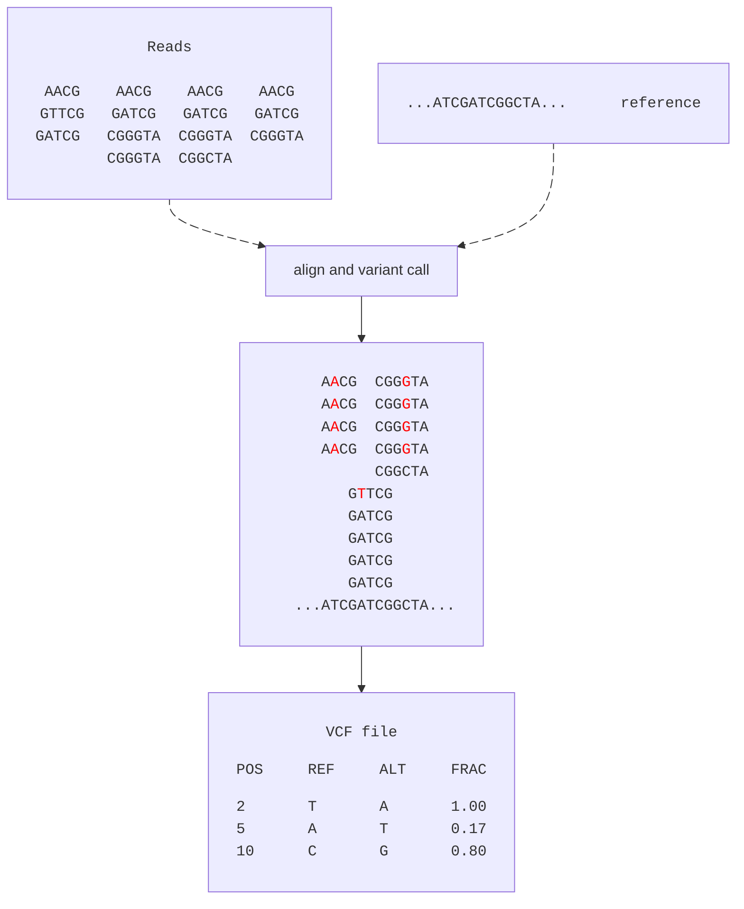

# VCF
The **V**ariant **C**all **F**ormat is related to, you guessed it, variant calling. In essence, a `.vcf` file is a text file containing potential variants (SNPs, indels, etc) in our sample (reads) with respect to the reference. A typical (simplified) variant call workflow is illustrated below. 

