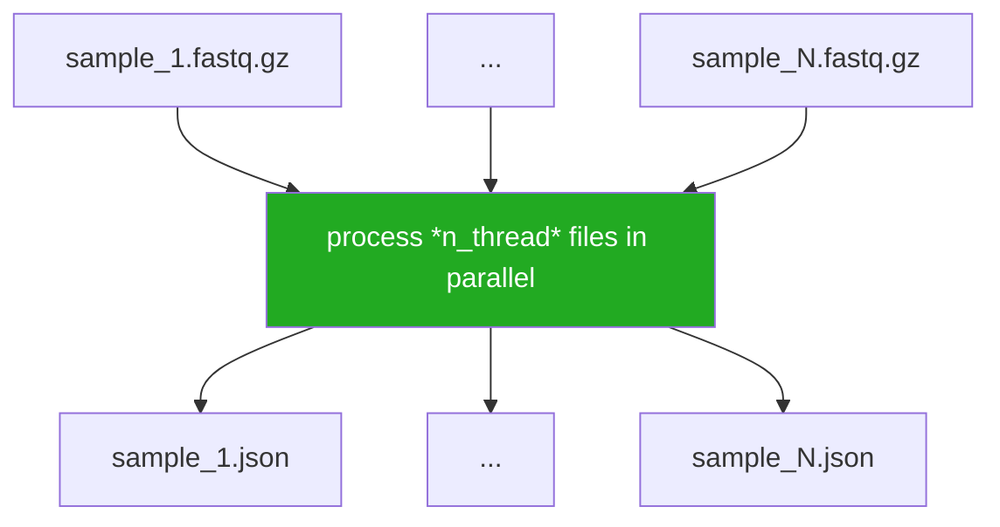
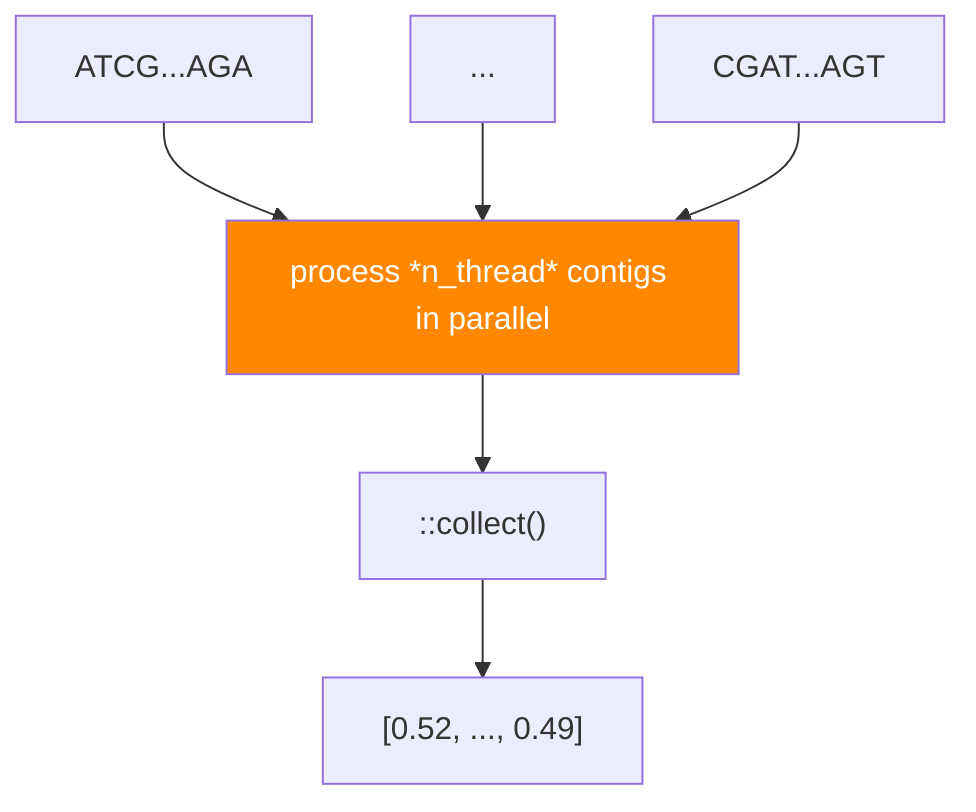
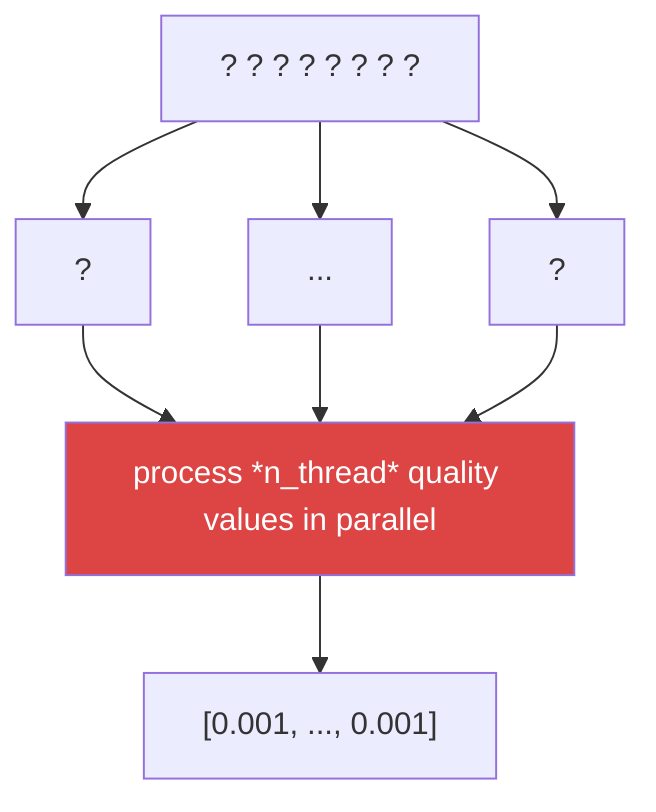

# Multithreading
We've discussed multithreading in an earlier [chapter](../rust_basics/multi_threading.md), but it is worth revisiting.

Multithreading enables us to literally run code in parallel, which is sometimes advantageous within bioinformatics. However, we should also be a bit careful about when multithreading helps and also when it hurts.

## Ideal Use Cases
Multithreading shines during CPU-heavy workloads when the outputs are independent of each other. A good example of this is calculating stats for multiple FASTQ files in parallel. Since the files (and their outputs) are completely independent, adding multithreading can be a huge win.

## Conditional Benefits
There are cases when multithreading might help, but the benefit depends on the specifics of the workload. Consider a single FASTA file, for which we'd like to process individual sequences in parallel. Maybe we'd like to calculate the `GC` content for each contig and collect the result in to a `Vec`. Here, we have a tradeoff between the time it takes to calculate the GC content for each contig vs the overhead of maintaining the logistics of a threadpool.

If the contigs are very short, the bottleneck probably isn't calculating GC content but rather the overhead of distributing nucleotide sequences to each thread. We also need to wait for every calculation to finish before we can access the resulting `Vec`. In this case, multithreading adds more overhead than it saves.

If the contigs are very long, e.g., if the FASTA file contains multiple large single contig genomes, the bottleneck might actually be the GC calculation itself. In this case, multithreading can provide a meaningful speedup.

The takeaway is to consider the ratio of useful computation to coordination overhead. When the work per unit is small relative to the cost of dispatching it to a thread, you might not see a benefit.

## When To Avoid Multithreading
A rather questionable example of using multithreading would be trying to convert a FASTQ ASCII quality string to error probabilities. E.g., trying to map `b"????????"` to `[0.001, 0.001, 0.001, 0.001, 0.001, 0.001, 0.001, 0.001]`. In theory, we could use `8` threads to attempt to do this in parallel. However, the arithmetic operation of converting `b'?'` to `0.001` is very fast and the bottleneck here is most likely maintaining the logistics around the threadpool we need to run this operation in parallel.

As a general rule, if the per-item computation takes less time than the overhead of scheduling work onto a thread, multithreading will make things slower, not faster. For cheap operations like arithmetic conversions or table lookups, a simple sequential loop will outperform a parallel one.

