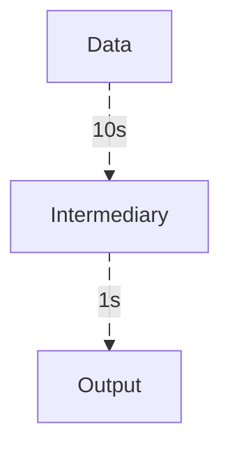

# Optimizing Bottlenecks
## The Problem
Code optimization deserves a separate book. Instead of covering every single aspect of code optimization (many of which are handled by the compiler), we'll touch on something that I myself am guilty of not doing enough - optimizing bottlenecks.

A bottleneck can generally be regarded as a piece of code or functionality that, within a specific context, has the <q>worst</q> performance. Performance in this case can mean runtime, RAM usage or something else. Consider a hypothetical data pipeline that contains two steps: one slow and one fast.



The total runtime is `11s`. Assume we have two choices: either optimizing the slow step from `10s -> 5s` (a factor of `2`) or optimizing the fast step from `1s -> 0.5s` (also a factor of `2`). We can calculate the relative and absolute reduction in runtime for these two optimizations. 


| optimize | old runtime | new runtime| rel. reduction | abs. reduction |
|--|--|--|--|--|
| fast | 11| 10.5| -4.5% | -0.5 |
| slow | 11| 6 	 | -45%  | -5	|

Obviously, optimizing the slow step gives more <q>bang for the buck</q>. It usually helps to think about the extreme cases. If we theoretically could get the fast step down to `0s`, the runtime is still `10s` due to the slow step. The slow step is a **bottleneck**.

The natural question would be - how do we identify bottlenecks in our actual code?

## Identifying
One way is to add a bunch of timestamps in our code, trying to measure the function execution times. In some cases, this works. However, if we want more fine grained resolution, we need something else like a `flamegraph`.

A `flamegraph` is a hierarchically structured chart that (usually) shows a ridiculous amount of detail about the execution times for individual function calls. For example consider the code below, where we do both light and heavy work.

> [!NOTE]
> For educational purposes, we use `#[inline(never)]` and `std::hint::black_box` in an attempt to avoid some compiler optimizations. Without these, the compiler may inline functions entirely, causing them to vanish as distinct frames in the flamegraph and making it impossible to attribute time to individual calls. In practice though, we prefer to let the compiler optimize freely.

```rust
use std::hint::black_box;

#[inline(never)]
fn fibonacci(n: u64) -> u64 {
    if n <= 1 {
        return n;
    }
    fibonacci(n - 1) + fibonacci(n - 2)
}

#[inline(never)]
fn sum_of_squares(limit: u64) -> u64 {
    (0..limit).map(|i| i * i).sum()
}

#[inline(never)]
fn count_primes(limit: u64) -> u64 {
    (2..limit)
        .filter(|&n| (2..n).all(|i| n % i != 0))
        .count() as u64
}

#[inline(never)]
fn heavy_work() -> u64 {
    let a = sum_of_squares(100_000);
    let b = count_primes(5_000);
    a + b
}

#[inline(never)]
fn light_work() -> u64 {
    let a = fibonacci(30);
    let b = sum_of_squares(10_000);
    a + b
}

fn main() {
    let a = black_box(heavy_work());
    let b = black_box(light_work());
    println!("{}", a + b);
}
```

Running this code through something like [Samply](https://github.com/mstange/samply) gives us a flamechart that will show:
- how much time in `main` is spent on `heavy_work` and `light_work` respectively.
- how much time in `heavy_work` is spent on `sum_of_squares` and `count_primes` respectively.
- how much time in `light_work` is spent on `fibonacci` and `sum_of_squares` respectively.
- Lots more details, most of which I don't fully understand myself.

## Optimizing
With the help of a `flamegraph`, we can understand what improvements and optimizations we need to take place. Sometimes, these are relatively easy fixes such as swapping for a more efficient hashing function in a `HashMap` or swapping a `Vec` for a fixed size array. Other times, the solutions are not that trivial.

The process of optimizing is iterative. Once the bottleneck has been resolved, usually there is another bottleneck that takes its place. The real challenge is knowing when to stop micro-optimizing.
