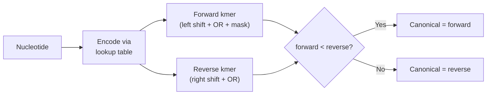

# Final Implementation
The code below combines the previous sections and adds an additional feature, which is canonical kmers. We define a canonical kmer as the lexicographically smallest kmer of the forward and reverse. This is a way to avoid keeping all kmers from the forward and the reverse strand.



```rust
# const LOOKUP: [u8; 256] = [
#     0, 1, 2, 3, 4, 4, 4, 4, 4, 4, 4, 4, 4, 4, 4, 4, 4, 4, 4, 4, 4, 4, 4, 4, 4, 4, 4, 4, 4, 4, 4, 4,
#     4, 4, 4, 4, 4, 4, 4, 4, 4, 4, 4, 4, 4, 4, 4, 4, 4, 4, 4, 4, 4, 4, 4, 4, 4, 4, 4, 4, 4, 4, 4, 4,
#     4, 0, 4, 1, 4, 4, 4, 2, 4, 4, 4, 4, 4, 4, 4, 4, 4, 4, 4, 4, 3, 3, 4, 4, 4, 4, 4, 4, 4, 4, 4, 4,
#     4, 0, 4, 1, 4, 4, 4, 2, 4, 4, 4, 4, 4, 4, 4, 4, 4, 4, 4, 4, 3, 3, 4, 4, 4, 4, 4, 4, 4, 4, 4, 4,
#     4, 4, 4, 4, 4, 4, 4, 4, 4, 4, 4, 4, 4, 4, 4, 4, 4, 4, 4, 4, 4, 4, 4, 4, 4, 4, 4, 4, 4, 4, 4, 4,
#     4, 4, 4, 4, 4, 4, 4, 4, 4, 4, 4, 4, 4, 4, 4, 4, 4, 4, 4, 4, 4, 4, 4, 4, 4, 4, 4, 4, 4, 4, 4, 4,
#     4, 4, 4, 4, 4, 4, 4, 4, 4, 4, 4, 4, 4, 4, 4, 4, 4, 4, 4, 4, 4, 4, 4, 4, 4, 4, 4, 4, 4, 4, 4, 4,
#     4, 4, 4, 4, 4, 4, 4, 4, 4, 4, 4, 4, 4, 4, 4, 4, 4, 4, 4, 4, 4, 4, 4, 4, 4, 4, 4, 4, 4, 4, 4, 4,
# ];
#
#
# fn decode(byte: u64) -> char {
#     match byte {
#         0 => return 'A',
#         1 => return 'C',
#         2 => return 'G',
#         3 => return 'T',
#         _ => panic!("Invalid nucleotide."),
#     };
# }
#
# /// Print a u64 encoded nucleotide with some bit manipulation.
# pub fn print_nt_string(kmer: u64, k: usize) {
#     let mut result = String::with_capacity(k);
#     for i in 0..k {
#         // Shift to extract the 2 bits corresponding to the current nucleotide
#         let shift = 2 * (k - i - 1);
#         let bits = (kmer >> shift) & 0b11;
#
#         result.push(decode(bits));
#     }
#     println!("{}", result);
# }
// [...]

pub fn kmerize(k: usize, nt_string: &[u8]) -> Vec<u64> {
    assert!(k <= nt_string.len());

    // Forward related kmer stuff
    let mut kmer_forward: u64 = 0;

    let nbits = k << 1;
    let mask: u64 = (1 << nbits) - 1;

    // Reverse related kmer stuff.
    let mut kmer_reverse: u64 = 0;
    let shift = ((k - 1) * 2) as u64;

    let mut valid_kmer_index: usize = 0;
    let mut canonical_kmers: Vec<u64> = Vec::new();

    nt_string.iter().for_each(|nt_char| {
        let nt = LOOKUP[*nt_char as usize] as u64;

        // Check for invalid nucleotides.
        if nt >= 4 {
            valid_kmer_index = 0;
            kmer_forward = 0;
            kmer_reverse = 0;
            return;
        }
        // Forward kmer.
        kmer_forward = (kmer_forward << 2 | nt) & mask;

        // Reverse kmer.
        let nt_rev = 3 - nt;
        kmer_reverse = kmer_reverse >> 2 | nt_rev << shift;

        if valid_kmer_index >= k - 1 {
            let canonical = match kmer_forward < kmer_reverse {
                true => kmer_forward,
                false => kmer_reverse,
            };

            print_nt_string(canonical, k);
            canonical_kmers.push(canonical);
        }

        valid_kmer_index += 1;
    });

    canonical_kmers
}

fn main(){
    let kmers_a = kmerize(5, b"AAAAAA");
    println!("");

    let kmers_t = kmerize(5, b"TTTTTT");
    println!("");

    // AAAAAA and TTTTTT are reverse complements, so they
    // should produce the same canonical kmers.
    assert_eq!(kmers_a, kmers_t);

    // Expected to not generate any kmers since we have an
    // invalid nucleotide interrupting every kmer.
    let kmers_n = kmerize(5, b"AAAANTTTT");
    assert!(kmers_n.is_empty());
    println!("");
}
```

When we run the code, we see that `AAAAAA` and `TTTTTT` generates the same canonical kmers which is expected since they are reverse complements of each other.
