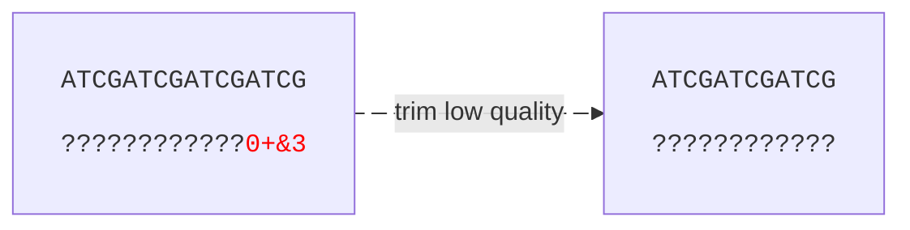
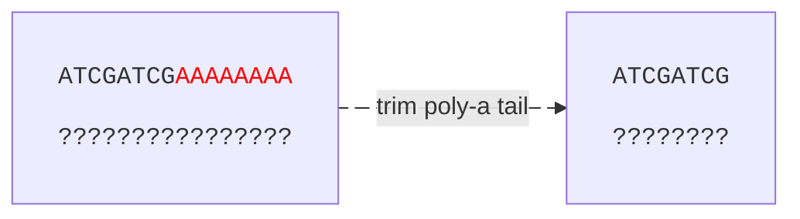
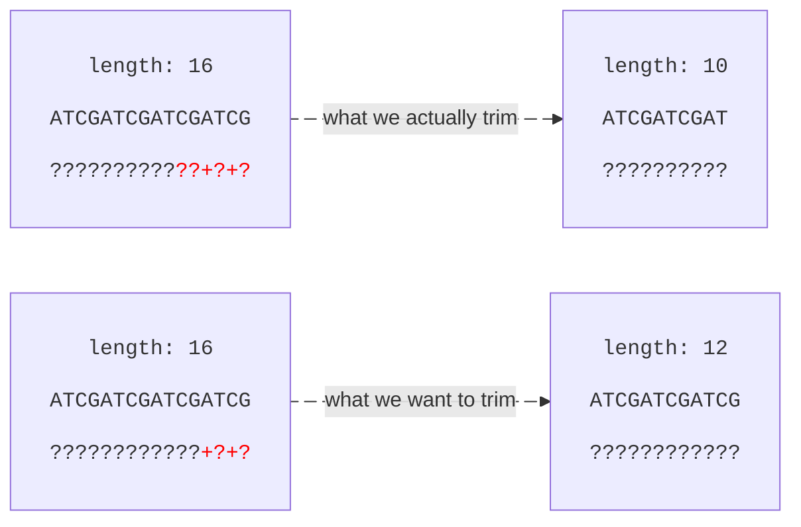

# Trimming
The final nucleotide manipulating strategy we'll look at is trimming.

Trimming means to conditionally remove parts of the start or end of a sequence based on some criteria. For example, in Illumina data the phred quality usually drops off towards the end of the reads, which is why it is common to trim the ends until a certain mean quality is reached.



In the example above, we have a drop in quality for the last four bases, so we trim these along with the nucleotide sequence. Another example is to trim off poly-A tails in RNA seq data.


> [!WARNING]
> When trimming reads, always make sure to trim both the quality scores and nucleotide sequences to equal lengths. This is required by the FASTQ format and will otherwise most likely break downstream tools.

## Types Of Trimming
There are multiple types of trimming we can apply and we'll list some examples below. For more inspiration, see [fastp](https://github.com/OpenGene/fastp).

| type | example usage |
|--|--|
| hard threshold | always trim the first/last `10` bases and quality scores |
| sliding window | trim windows from start/end that have a mean quality lower than `threshold` |
| barcode		 | search for and remove specific barcodes, e.g., `ATATAT`|
| prefix/suffix	 | remove reads that start/end with e.g., `AAAAAAAAA` |


## Implementing A Trimmer
For our code example, we'll implement a very basic trimmer that:
- Checks the mean phred score of windows in the forward direction.
- Finds the index for the first occurring low quality window.
- Returns a new read with trimmed sequence and quality.  

```rust
#[derive(Debug)]
struct FastqRead<'a> {
    seq: &'a [u8],
    qual: &'a [u8],
}

fn to_phred(ascii: u8) -> u8 {
    ascii - 33
}

impl<'a> FastqRead<'a> {
    fn trim_qual(&'a self, min_phred: u8, window_size: usize) -> Option<FastqRead<'a>> {
        // check windows in forward direction.
        let low_qual = &self.qual.windows(window_size).enumerate().find(|(_, w)| {
            let mean_phred = w.iter().map(|ascii| to_phred(*ascii)).sum::<u8>() / w.len() as u8;

            mean_phred < min_phred
        });

        match low_qual {
            None => None,
            Some((i, _)) => Some(FastqRead {
                seq: &self.seq[..*i],
                qual: &self.qual[..*i],
            }),
        }
    }
}

fn main() {
    let read = FastqRead {
        seq: b"ATCGATCGATCGATCG",
        qual: b"????????????+?+?",
    };

    let trimmed_read = read
        .trim_qual(30, 3)
        .expect("should return a valid FastqRead");

    assert_eq!(trimmed_read.seq, b"ATCGATCGAT");
    assert_eq!(trimmed_read.qual, b"??????????");
}
```

As always, we have a few remarks about our code:
1. We calculate the mean phred score by averaging phred scores directly without first converting to error probabilities. Visit the [phred score](../phred_score/introduction.md) chapter for why this might be problematic.
2. We haven't applied any filtering on e.g., read length. A low quality read may be trimmed to the point where it makes sense to discard it entirely.
3. We are looking at a quality drop off from the start of the read rather than the end. If this was Illumina data, it would make sense to iterate backwards with `.rev()`.
4. We might actually be over-trimming a bit. The reason for this is simple. We iterate in the forward direction and the first quality window that drops below a mean phred score of `30` is `??+`. Because we iterate forwards, the window index will be equivalent to the index of the first `?` in `??+`. When we later trim with `[..*i]` we actually remove the entire sequence `??+` and everything after. Ideally, we'd want to trim the `+` and everything after whilst keeping `??` because they are still high quality.



## Conclusions
There is a lot of stuff to consider when it comes to read trimming. For example, if we are dealing with Illumina data we have to keep track of the number of reads in `pe1` and `pe2`. If we discard a read in `pe1` we also want to remove it in `pe2`.

For barcodes, we'd preferably want to enable approximate matches to account for sequencing errors (we could use the `Myers` module from the `bio` crate). [Cutadapt](https://cutadapt.readthedocs.io/en/stable/) is otherwise a very viable cli tool for trimming barcodes.
