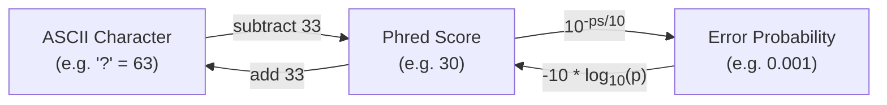

# Phred Score
Within bioinformatics, phred quality scores are used in FASTQ files to estimate the error probability for each base.  

There are three concepts we need to understand before proceeding:
- `Error Probability` - The probability that a particular nucleotide was called incorrectly by the sequencing machine. For example, a nucleotide `A` with error probability `0.001` means there is a 0.1% likelihood that this `A` is actually something else, like a `C`, `G` or `T`. There are two issues with this approach:
	- Assigning a particular error probability to a single called nucleotide might be a bit misleading. The nucleotide is either correct, or it is not. There is no <q>in between</q>. Consider the analogy of blindly throwing a die and guessing the outcome. Once the die has stopped rolling, it has a particular value (1-6). When making a guess, you can either be 100% wrong, or 100% right. However, if you **repeat** the experiment enough times, you'll be right about `1/6` of the times.

	- Error probabilities are a bit incomplete. For example, how do we estimate a deleted nucleotide? It won't be present in the FASTQ file (because it is deleted) so we cannot assign an error probability to this. To be honest, I'm not sure how this is handled (if it even is) by the sequencing machine.

> [!NOTE]
> Error probabilities are statistical estimates across many sequencing events, not absolute truths about individual bases. A base with error probability 0.001 is either correct or incorrect — the probability reflects how often similar bases are miscalled across many reads. Additionally, phred scores only capture substitution errors. Deletion and insertion errors are not represented in the FASTQ quality line, since deleted bases are absent from the read entirely.

- `Phred Score` - Is a logarithmically encoded error probability, expressed as an integer. E.g., a phred score of `30` corresponds to an error probability of `0.001`. Why do we care about phred scores? We don't want to include a bunch of floating point numbers in our FASTQ file because we'll run into issues such as rounding, etc.

- `ASCII Quality` - The ASCII character associated with the error probability, and hence, the phred score of a particular nucleotide. This is what is found in the actual FASTQ file. Why an ASCII character? Because they are fixed length characters (of length 1). This gives a very nice mapping of `one nucleotide` -> `one ASCII` quality value. The conversion between `ASCII` and `phred score` uses a phred score offset. The reason is that the first 31 ASCII characters are non-printable and the 32nd is the space character `' '`. To account for the fact that our <q>zero</q> or lowest quality value starts as ASCII character 33, an offset of 33 is commonly used. E.g., the ASCII character `!` has value 33 equates to a phred score of `33 - 33 = 0`.

Since ASCII, phred scores and error probabilities are related, we can convert between them.

## A Quick Look At The Maths

### Error Probability
We won't go through the details about the [maths](https://en.wikipedia.org/wiki/Phred_quality_score) regarding phred scores and error probabilities, but the equality looks something like this:

\\[ error\\_probability = 10^{-(ASCII - \text{phred_offset})/10} \\]

where 

\\[ phred\\_score = ASCII - \text{phred_offset} = ASCII - 33 \\]

We can now test this formula. Assume we'd want to convert `?` to an error probability using `phred_offset = 33`. Since the ASCII value of `?` is `63`, this would equate to:

\\[ error\\_probability = 10^{-(63 - 33)/10}  = 10^{-3} = 0.001 \\]

### Phred Score
Similarly, we can get our `phred_score` through

\\[ \text{phred_score} = -10 * log_{10}(\text{error_probability}) \\]

E.g., for an error probability of 0.001, we get

\\[ \text{phred_score} = -10 * log_{10}(0.001) = 30 \\]

which would give an ASCII value of `30 + 33 = 63`, or `?`

> [!TIP]
> Now that we understand the relationship between ASCII, phred scores, and error probabilities, the next chapter covers a surprisingly subtle topic: [how to correctly calculate mean error probabilities](./calculating_mean.md).
