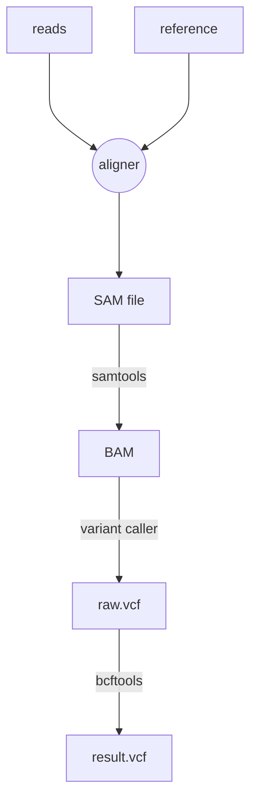

# Workflow Overview
A typical variant calling workflow looks something like the image below

Typically, we'd first align the reads to the reference to produce a `.sam` file. Although several good aligners exist, my personal favorite is [minimap2](https://github.com/lh3/minimap2).

SAMtools can then be used for conversion, sorting and indexing to produce a `.bam` file. Here, we can also optionally filter our bad alignments.

Next, we input the `.bam` file into our variant calling software to produce a raw `.vcf` file. The choice of variant caller depends on factors such as sequencing platform and the sample characteristics (e.g., ploidy, etc). Some examples are [bcftools mpileup](https://samtools.github.io/bcftools/howtos/variant-calling.html), [freebayes](https://github.com/freebayes/freebayes) and [clair3](https://github.com/HKU-BAL/Clair3).

Normally, we also want to process the raw `.vcf` file to e.g., filter out low quality variants. BCFtools is an excellent option here.
