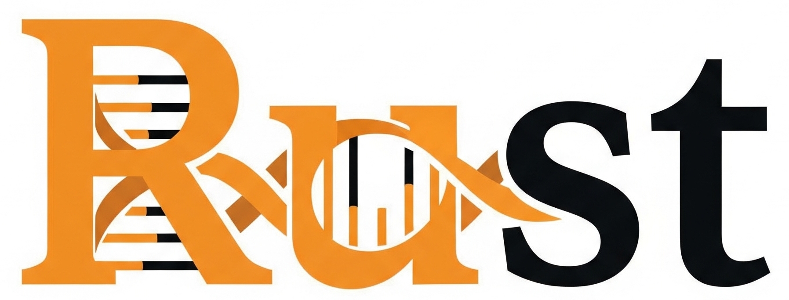

# Introduction
Welcome to Bioinformatics with Rust! An unofficial book aimed at introducing the Rust programming language for bioinformatic applications. Before we start:

* This book is **not** in any way, shape or form, an official introduction to neither the Rust programming language, nor bioinformatics.
    - For an introduction to Rust, please visit [resources](../../suffix/1_resources.md#resources).
    - For learning bioinformatics, please visit your favorite university.

* The **purpose** of this book is trifold:
    - Explain common bioinformatic concepts in a (hopefully) clear way.
    - Showcase some basic Rust implementations from scratch.
    - Provide examples of awesome open-source Rust crates for bioinformatics.

* We'll mostly deal with DNA sequences and canonical nucleotides. However, feel free to request additional topics by filing a [GitHub issue](https://doc.rust-lang.org/nomicon/meet-safe-and-unsafe.html).

* For any issues related to this book, please file a [GitHub issue](https://github.com/OscarAspelin95/bioinformatics_with_rust/issues).

* Currently, I'm a single person working on this project. If this project grows, I most likely need help from other people. Contributions are welcome!

