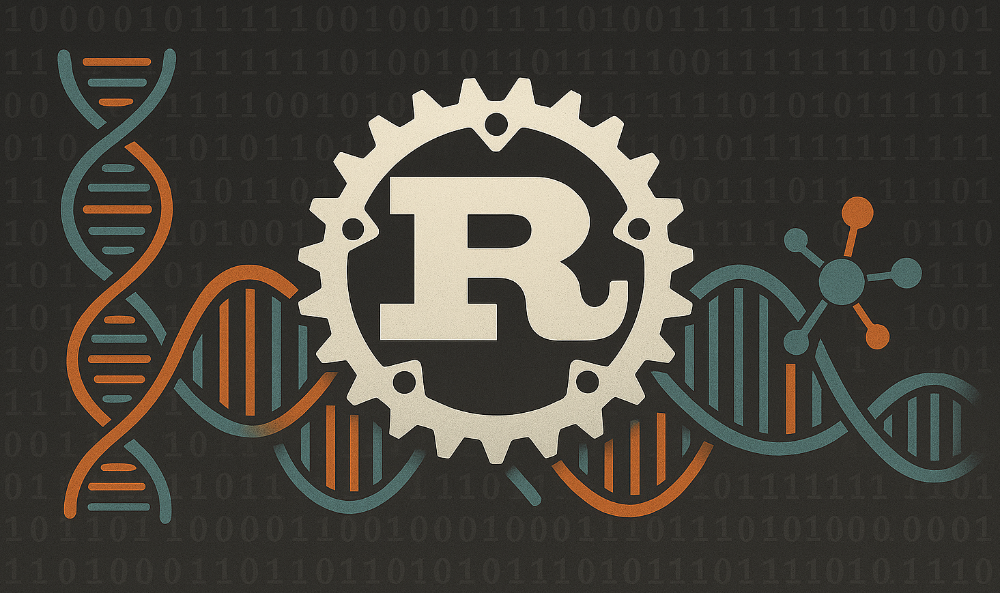
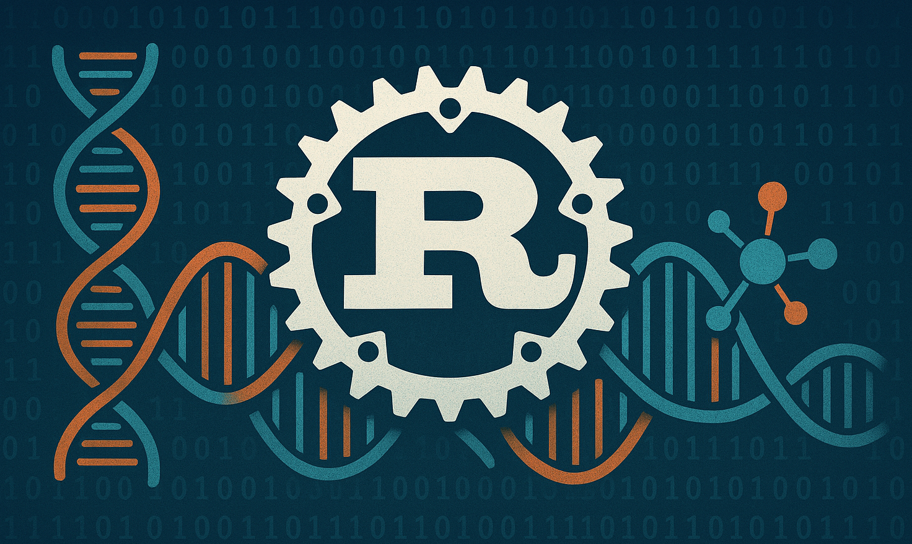

# Introduction

- This book is **not** in any way, shape or form, an official introduction to neither the Rust programming language, nor bioinformatics.
    - For a comprehensive introduction to Rust, please visit [resources](../suffix/1_resources.md#resources).
    - For learning bioinformatics, please visit your favorite university.

- The **purpose** of this book is trifold:
    - Explain common bioinformatic concepts in a (hopefully) clear way.
    - Showcase some basic Rust implementations from scratch.
    - Provide examples of awesome open-source Rust crates for bioinformatics.

- Since `mdbook` is not easily integrated with external Rust crates, the code examples are minimally viable and built with native Rust. Throughout the book, however, examples of GitHub repositories and external Rust crates are provided as a way to showcase more real life applications.

- We'll mostly deal with DNA sequences and canonical nucleotides. However, feel free to request additional topics.

- For any issues related to this book, please file a [GitHub issue](https://github.com/OscarAspelin95/bioinformatics_with_rust/issues).

- Currently, I'm a single person working on this project. If this project grows, I most likely need help from other people. Contributions are welcome!

