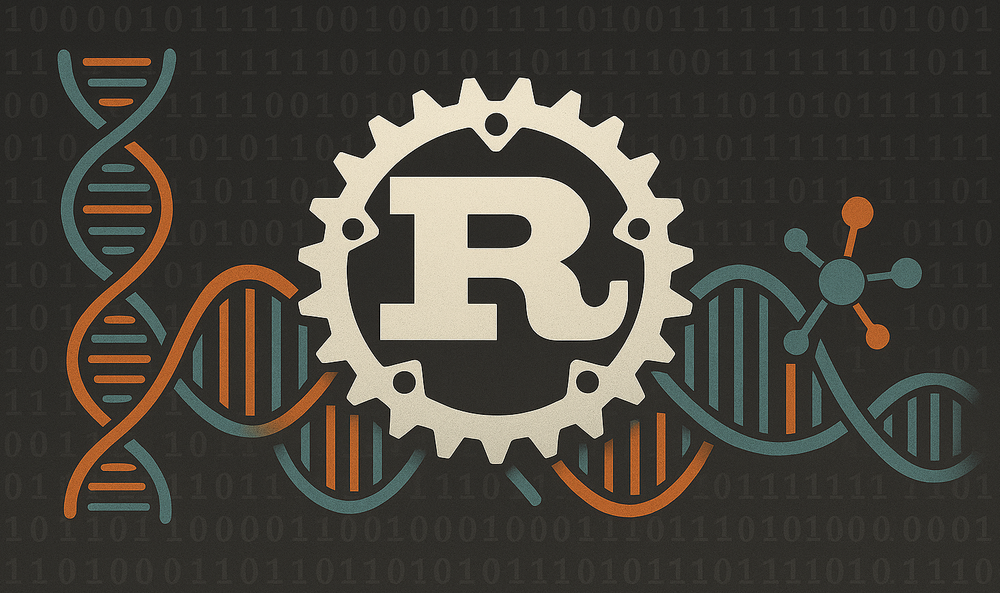
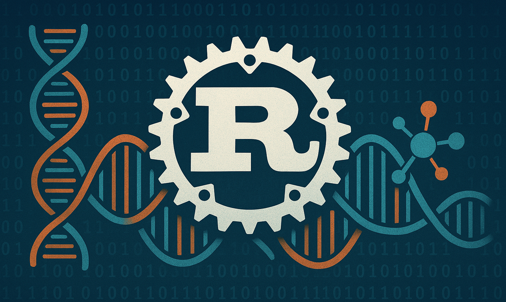

# Introduction

This book is **not** in any way, shape or form, an official introduction to neither the Rust programming language, nor bioinformatics. For a comprehensive introduction to Rust, please visit [resources](../suffix/resources.md#resources). For learning bioinformatics, please visit your favorite university.

With that said, the **main** purpose is actually for me to learn more about Rust and bioinformatics. Along the way, I realized that I might as well make this open source. I'd be beyond happy if it turns out that this book has helped someone else other than me. I've spent a significant amount of time and energy into writing this book by hand (free of AI slop). Even though I've tried to proof read, you'll probably encounter errors (spelling, grammar, factual, etc) here and there. I'd be surprised if you didn't.

Throughout the book, there are a lot of code examples. It is important to note that these examples are not necessarily optimized for performance (some are). Rather, the goal is to showcase how we can codify common bioinformatic concepts into a working prototype. Since `mdbook` is not easily integrated with external Rust crates, the code examples are minimally viable and built with native Rust. Throughout the book, however, examples of GitHub repositories and external Rust crates are provided as a way to showcase more real life applications.

For any issues related to this book, please file a [GitHub issue](https://github.com/OscarAspelin95/bioinformatics_with_rust/issues). Currently, I'm a single person working on this project. If this project grows, I most likely need help from other people. Contributions are welcome!

